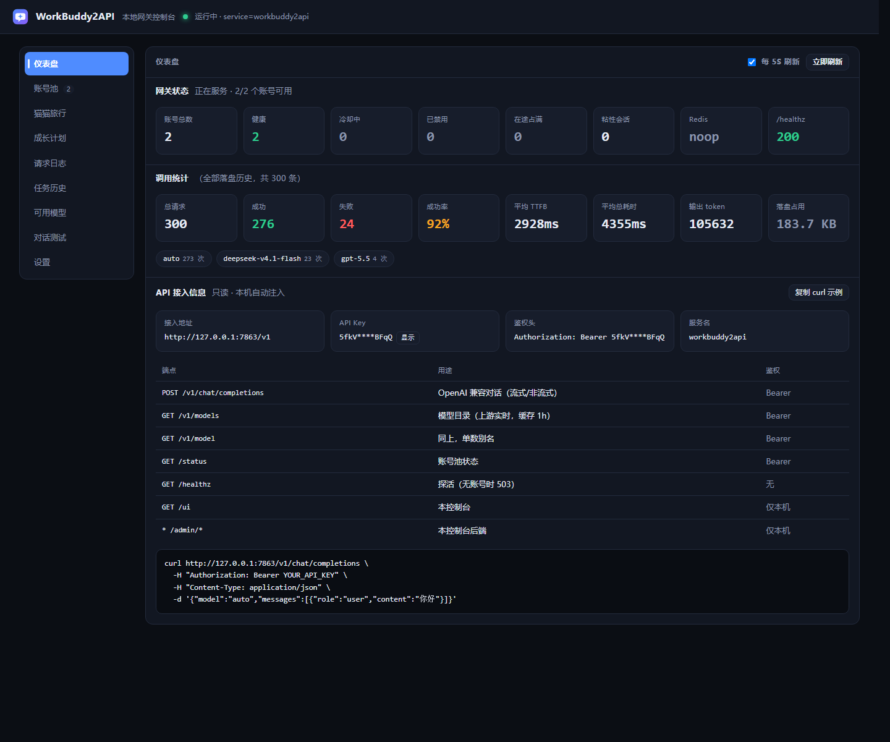
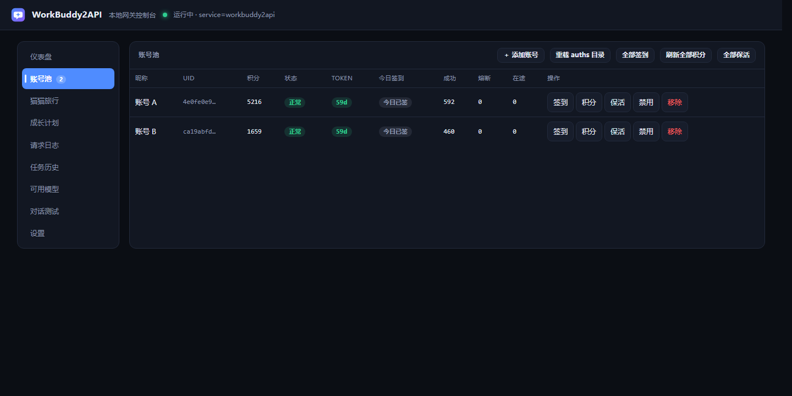
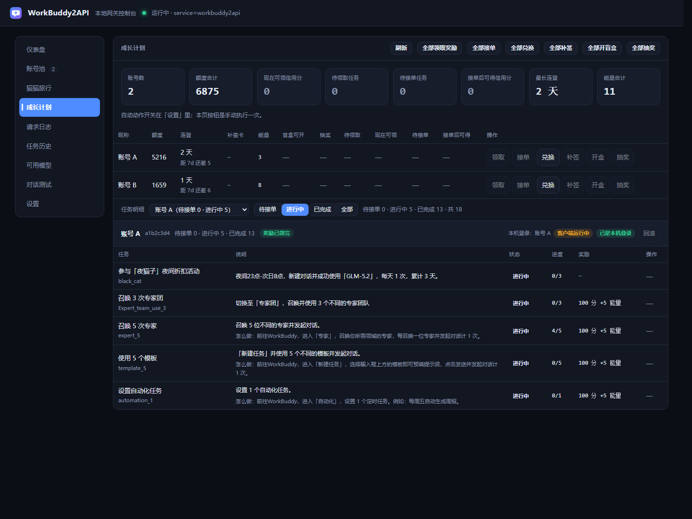
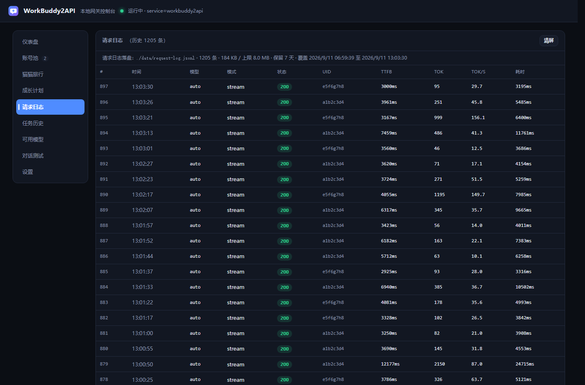
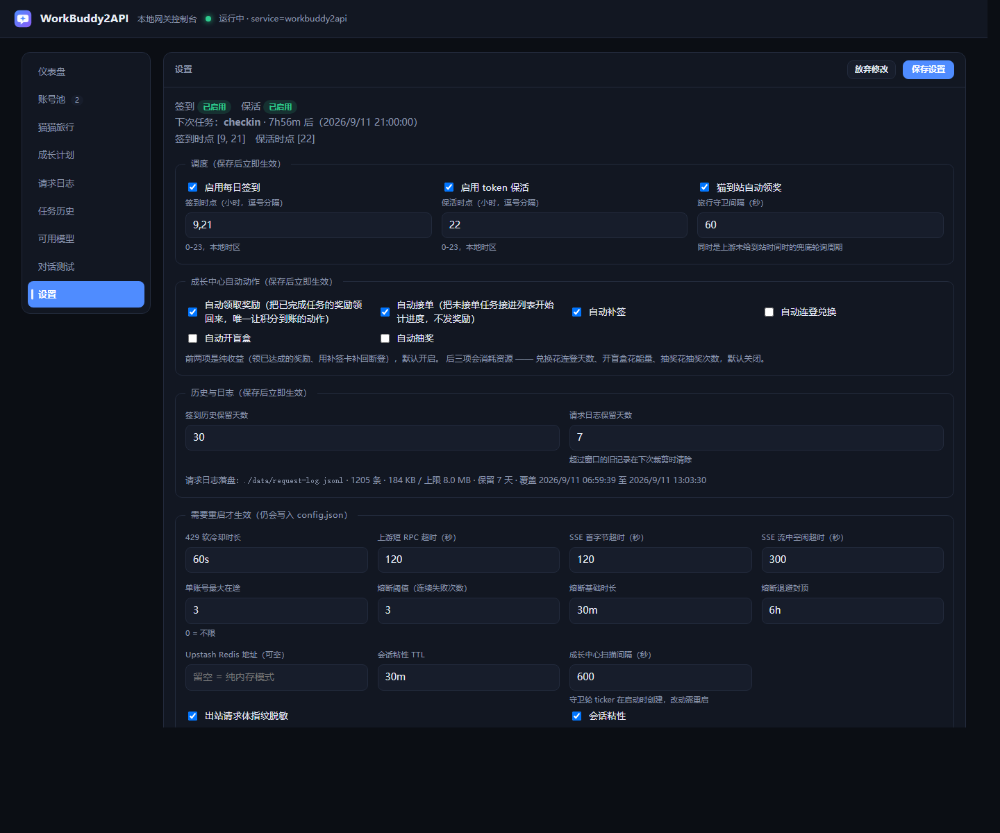
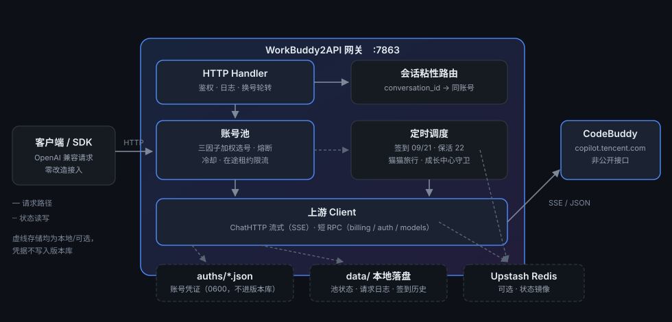
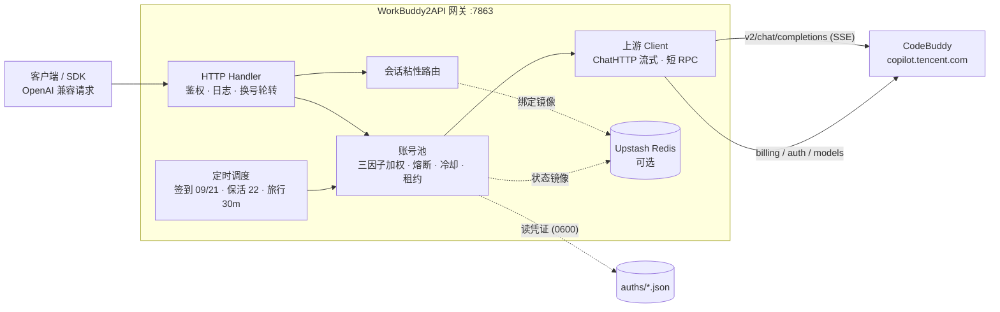

<p align="center">
  
</p>

<h1 align="center">WorkBuddy2API</h1>

<p align="center">
  <b>把腾讯 CodeBuddy 账号变成 OpenAI 兼容 API 的多账号网关</b><br>
  OAuth 登录 · 账号池轮转 · 熔断与冷却 · 会话粘性 · 定时签到保活 · 流式/非流式
</p>

<p align="center">
  
  
  
  <a href="https://github.com/Practice019/workbuddy2api/releases/latest"></a>
  <a href="https://github.com/Practice019/workbuddy2api/actions/workflows/ci.yml"></a>
  
</p>

---

## 📖 项目简介

WorkBuddy2API 是一个自托管的 **OpenAI 兼容反向代理网关**，将腾讯 CodeBuddy（`copilot.tencent.com`）账号包装为统一的 `/v1/chat/completions` 服务。

- 官方不提供 OpenAI 形态的开放 API，本项目通过 **OAuth 设备授权** 获取账号凭证，在网关侧做 token 自动刷新、账号池调度与流量治理；
- 面向 **个人多账号** 场景：多账号共享、单号故障自动换号、冷却/熔断防止雪崩、会话粘性保证多轮上下文不跳号；
- 对客户端只暴露 OpenAI 兼容接口，现有 SDK / 前端 / 工具 **零改造接入**。

> ⚠️ **合规须知**：本项目是**非官方**网关，使用 CodeBuddy 账号作为上游，**仅限本人授权账号、本机/私有环境测试**。详细边界见 [安全与合规](#-安全与合规) 与 [SECURITY.md](SECURITY.md)。

> 📦 **本仓库定位**：`Sliverkiss/workbuddy2api` 的**私有衍生版本**。在 MIT 许可下保留上游版权声明，并追加了本地管理控制台、请求日志缓冲、签到历史等扩展（详见 [本仓库扩展](#-本仓库扩展自上游的增量)）。上游更新请从原仓库获取。

## 👀 预览

| 仪表盘 | 账号池 |
|:---:|:---:|
|  |  |

| 成长计划 | 请求日志 |
|:---:|:---:|
|  |  |

| 设置 | |
|:---:|:---:|
|  | |

> 截图均来自运行中的真实网关（`/ui`），**所有可识别信息已脱敏**：API Key → `YOUR_API_KEY`，账号昵称 → `账号 A` / `账号 B`，账号 UID 缩写 → `a1b2c3d4` / `e5f6g7h8`。脱敏在 **API 响应层**完成（截图前拦截 fetch 改写 JSON），因此表格、下拉框、状态行里都不会残留真实值。

## 🗺️ 架构总览



<details>
<summary>等价的 Mermaid 版本（便于在源码里修改）</summary>



</details>

## ✨ 核心能力

| 能力 | 说明 |
|---|---|
| 🔑 **OAuth 一键登录** | `login.sh` 设备授权流程（无 PKCE），自动落盘凭证并重启容器 |
| 🔄 **多账号池** | 三因子加权随机选号（积分比例 ×10 + 闲置补偿 + 成功率 ×3），Top-5 候选 + 防惊群 |
| 🛡️ **熔断与冷却** | 429/404 软冷却（**连续触发指数退避**，封顶 `soft_rate_max`）、402/余额不足硬冷却至次日 04:00、连续失败指数退避熔断、在途租约限流 |
| 🎯 **模型级限流收窄** | 429 `code=6004` 带「将在 … 重置」时冷却精确到上游给的重置墙钟；**换模型立即豁免**（被单模型限流不再等于整个号废掉） |
| 🧲 **会话粘性** | 同一会话（`conversation_id`）尽量绑定同一账号，TTL 滚动续期，失败自动解绑 |
| ⏰ **定时任务** | 每日 09:00 / 21:00 自动签到 + 余额查询解冻 + 猫猫旅行（派猫/领奖）；22:00 全账号 token 刷新保活；**可选**的整点对话活跃上报 |
| 📣 **对话活跃上报** | `POST /v2/report`（`chat_request_send` 全字段形状）—— 点亮连登 + **解锁 `first_buddy`（领养前置）**。默认关闭，配 `schedule.activity_hours` 启用 |
| ⚡ **流式 + 非流式** | 上游 SSE 逐帧规范化透传；出站强制 `stream:true`，非流式由本地聚合为单响应 |
| 🧠 **推理模型兼容** | `reasoning_content` 白名单保留、工具调用（`tool_calls`）按 index 合并、effort 自动降级；**DeepSeek 思维链注入**（`thinking.type=enabled` + 默认档）与**多轮 `reasoning_content` 回填** |
| 💬 **系统提示词体系** | 出站前用网关自有提示词**替换**客户端 system/developer，从源头消灭 system 来源的内容误报；`passthrough` 模式撞拦截时**自动降级重试一次**（次日 00:00 CST 重置） |
| 🗑️ **指纹脱敏** | 出站请求体黑名单指纹清洗（可关闭）：Claude Code / Codex 身份句、`11128` 反探测、`tool_calls.arguments` 盲区、billing header 与尾随 kv |
| 🪪 **出站身份可配** | UA（CLI / 桌面端三段式）、用量归属头 `X-IDE-*`、设备风控头 `X-Device-Token`（三源优先级）、客户端 IP 透传 —— **全部 opt-in，不配时与改造前逐字节一致** |
| 🚧 **请求体上限** | `server.max_body_mb`（默认 8）超限返回 **413**，而不是静默截断后让上游回 `11101` |
| 📊 **可观测** | 每请求一行表格日志（TTFB/token 速率/uid）；`/healthz` 带 `service` 身份标识可接负载均衡/宿主探活 |
| 💾 **状态持久化** | 池状态本地原子落盘 + Upstash Redis 异步镜像（可选），重启择新恢复 |
| 🖥️ **本地管理控制台** | `/ui` 单页 WebUI（本仓库扩展）：仪表盘 / 账号池 / 猫猫旅行 / 成长计划 / 请求日志 / 任务历史 / 设置 |
| 🐾 **第三个上游：Loomy** | 讯飞 Loomy 桌面客户端的模型服务，OpenAI 兼容。一个 `session` 字符串即凭证，**纯转发**（见「Loomy 上游」一节） |

## 🚀 快速开始

### 环境要求

- **一个（或多个）已注册的 CodeBuddy 账号**，用于 OAuth 登录
- **宿主机 7863 端口空闲**

运行方式三选一，**按上手难度排序**：

| 方式 | 需要什么 | 适合谁 |
|---|---|---|
| **[A. 下载预编译包](#a-下载预编译二进制推荐)** | 什么都不装，解压双击 | Windows 用户 / 想最快跑起来 |
| **[B. 从源码构建](#b-从源码构建)** | Go 1.22+ | 想改代码 / 非 amd64 架构 |
| **[C. Docker Compose](#c-docker-compose)** | Docker | 服务器部署 / 想要容器隔离 |

> 预编译包由 GitHub Actions 在干净环境里构建（`-trimpath`，不含作者机器路径），每次打 tag 自动更新。见 [Release 页](https://github.com/Practice019/workbuddy2api/releases/latest)。

---

### A. 下载预编译二进制（推荐）

到 [Releases](https://github.com/Practice019/workbuddy2api/releases/latest) 下载对应平台的包：

| 平台 | 文件 |
|---|---|
| Windows (x64) | `wb2api-server-windows-amd64.zip` |
| Linux (x64) | `wb2api-server-linux-amd64.tar.gz` |

**Windows：**

```text
1. 解压到一个固定目录，例如 D:\wb2api\
2. 把 config.example.json 复制为 config.json
3. 用编辑器改 config.json 里的 "api_key"（改成你自己的强随机串）
4. 双击 start.bat
```

解压后的目录应该长这样：

```
D:\wb2api\
├── start.bat
├── wb2api-server.exe
├── config.example.json
└── config.json          <- 由 config.example.json 复制并改名而来
```

首次启动会自动创建 `auths\`（账号凭证）与 `data\`（池状态、日志、历史）两个目录。
浏览器打开 **http://127.0.0.1:7863/ui** 即进入本地控制台，在「账号池 → ＋ 添加账号」里完成 OAuth 登录。

> `start.bat` 会自动在**两个位置**找可执行文件，所以 Release 包（exe 与 bat 同级）和
> 源码检出（exe 在 `bin\`）两种布局都能直接双击运行，不必手动调整目录结构。

**Linux：**

```bash
tar xzf wb2api-server-linux-amd64.tar.gz
cd wb2api-server-linux-amd64
cp config.example.json config.json
# 编辑 config.json 设置 api_key
chmod +x wb2api-server
./wb2api-server -config config.json
```

> **校验下载完整性**（可选）：Release 附带 `SHA256SUMS.txt`
>
> ```powershell
> # Windows
> Get-FileHash .\wb2api-server-windows-amd64.zip -Algorithm SHA256
> ```
>
> ```bash
> # Linux
> sha256sum -c SHA256SUMS.txt --ignore-missing
> ```
>
> ⚠️ 本仓库的二进制**未经代码签名**。Windows SmartScreen 可能提示"未知发布者"，Linux 无
> 包管理器集成。介意的话请用方式 B 自己编译 —— 那也是本项目最推荐的验证方式。

---

### B. 从源码构建

需要 **Go 1.22+**。

```bash
git clone https://github.com/Practice019/workbuddy2api.git
cd workbuddy2api
cp config.example.json config.json
# 编辑 config.json 设置 api_key

CGO_ENABLED=0 go build -trimpath -ldflags="-s -w" -o bin/wb2api-server ./cmd/server
./bin/wb2api-server -config config.json
```

Windows 上把最后两行换成：

```powershell
$env:CGO_ENABLED = '0'
go build -trimpath -ldflags="-s -w" -o bin\wb2api-server.exe .\cmd\server
.\bin\wb2api-server.exe -config config.json
```

> `-trimpath` **不要省**：不加它，二进制里会写进你本机的绝对路径与 Go module 缓存路径
> （如 `C:/Users/<你的用户名>/go/pkg/mod/...`）。自己用无所谓，但若要把产物分享给别人就该去掉。

构建完成后同样可以双击 `start.bat`（它会在 `bin\` 与同级目录两处自动查找可执行文件）。

### 2. 登录添加账号

```bash
./login.sh
# 1) 脚本输出授权 URL
# 2) 浏览器打开完成登录
# 3) 回到终端按 y → 自动签到 → 落盘 auths/workbuddy-<uid>.json → 重启容器
```

多账号只需重复执行；账号池自动发现 `auths/` 下新增凭证文件（容器启动时 `SyncToDir` 对齐）。

> 也可以完全在网页里添加：打开 `/ui` → 「账号池」→ 「＋ 添加账号」，
> 走同样的 OAuth 流程且**热加载进池，无需重启**。

### C. Docker Compose

```bash
docker compose up -d --build
```

**Windows 本机直接运行**（不走 Docker）：

仓库根目录有一个 `start.bat`，**双击即可启动**：

```bat
start.bat
```

需要额外参数时（比如换一份配置）：

```bat
start.bat -config other.json
```

> `start.bat` 必须保持**纯 ASCII**。`cmd.exe` 按系统 OEM 代码页（中文 Windows 为 936/GBK）解析 `.bat` 内容，UTF-8 的中文字节会被误解码并破坏语法。中文说明在 README，不写进 bat。详细见 bat 内的注释。

等价的命令行启动方式（等价于双击 `start.bat`）：

```powershell
cd path\to\workbuddy2api
.\bin\wb2api-server.exe -config config.json
```

其中 `-config config.json` 可以省略 —— 它本就是程序自身的 flag 默认值（见 `cmd/server/main.go`）；真正决定成败的是前面那句 `cd`。

### 4. 验证

```bash
# 健康检查（无可用账号时 503）；service 字段用于确认打到的是本网关
curl -s http://localhost:7863/healthz
# {"healthy":2,"total":3,"service":"workbuddy2api"}

# 模型列表
curl -s http://localhost:7863/v1/models \
  -H "Authorization: Bearer your-api-key"

# 账号状态（汇总 + 每账号详情）
curl -s http://localhost:7863/status \
  -H "Authorization: Bearer your-api-key"

# 流式聊天
curl -sN http://localhost:7863/v1/chat/completions \
  -H "Authorization: Bearer your-api-key" \
  -H "Content-Type: application/json" \
  -d '{"model":"deepseek-v4-flash","messages":[{"role":"user","content":"hi"}],"stream":true}'

# 非流式聊天（本地聚合）
curl -s http://localhost:7863/v1/chat/completions \
  -H "Authorization: Bearer your-api-key" \
  -H "Content-Type: application/json" \
  -d '{"model":"deepseek-v4-flash","messages":[{"role":"user","content":"hi"}],"stream":false}'
```

## ⚙️ 配置说明

`config.json` 是网关的单一写入口。`config.example.json` 是仓库随附的最小可工作模板；启动时若该文件不存在则用纯默认 + 环境变量。

完整的字段表见下表，**所有字段均可省略**（省略则用默认值）；环境变量优先级最高，可用于临时覆盖（见后文）。

完整字段以 [`config.example.json`](config.example.json) 为样例（下表为各字段含义）。

```json
{
  "listen": ":7863",
  "api_key": "your-api-key-here",
  "auth_dir": "./auths",
  "state_file": "./data/state.json",
  "server": { "max_body_mb": 8 },
  "cooldown": { "soft_rate": "60s", "soft_rate_max": "2h" },
  "schedule": {
    "checkin_hours": [9, 21],
    "keepalive_hours": [22],
    "activity_hours": [10],
    "checkin_enabled": true,
    "keepalive_enabled": true,
    "activity_enabled": true
  },
  "upstream": {
    "timeout_seconds": 120,
    "header_timeout_seconds": 120,
    "idle_timeout_seconds": 300,
    "user_agent": "",
    "client_version": "",
    "cli_version": "",
    "client_name": "",
    "device_token": "",
    "device_token_file": "",
    "passthrough_ip": false
  },
  "prompt": { "mode": "custom", "file": "" },
  "features": { "sanitize_blacklist_fingerprints": true },
  "upstash": { "url": "", "token": "" },
  "pool": {
    "max_in_flight": 3,
    "breaker_threshold": 3,
    "breaker_cooldown": "30m",
    "breaker_cooldown_max": "6h",
    "idle_weight_per_hour": 0.5,
    "idle_weight_max": 5.0
  },
  "session_sticky": { "enabled": true, "ttl": "30m", "gc_interval": "5m" }
}
```

### 字段速查

| 字段 | 默认 | 说明 |
|---|---|---|
| `listen` | `:7863` | HTTP 监听地址 |
| `api_key` | 空 | 网关鉴权密钥；**空 = 不鉴权直接放行**（公网必须设置） |
| `auth_dir` | `./auths` | 账号凭证目录 |
| `state_file` | `./data/state.json` | 账号池状态持久化文件 |
| `server.max_body_mb` | `8` | 单次请求体上限（MiB）。超限返回 **413**；`<=0` 回落 8，上界夹到 1024 |
| `cooldown.soft_rate` | `60s` | 429/404 软冷却基线 |
| `cooldown.soft_rate_max` | `2h` | 软冷却**指数退避**封顶（连续 429 时 `soft_rate × 2^(n-1)`）；它同时是 6004 模型级冷却的上限 |
| `schedule.checkin_hours` | `[9, 21]` | 每日本地时区整点签到 + 余额查询；收尾顺带跑一趟猫猫旅行。**空数组/`null` = 未配置回落默认**（不是禁用） |
| `schedule.keepalive_hours` | `[22]` | 每日本地时区整点刷新 token 保活。空数组/`null` 同上 |
| `schedule.activity_hours` | `[]` | 对话活跃上报时点。**⚠ 空数组 = 不启用**（与上面两项相反，见下） |
| `schedule.checkin_enabled` | `true` | 签到**总开关**；`false` 真正关掉签到（**猫猫旅行随之停摆**，见下） |
| `schedule.keepalive_enabled` | `true` | token 保活总开关；`false` 关掉保活 |
| `schedule.activity_enabled` | `true` | 活跃上报总开关。最终是否跑 = `activity_enabled && len(activity_hours) > 0` |
| `upstream.timeout_seconds` | `120` | 短 RPC（刷新/签到/余额/模型）总时长上限 |
| `upstream.header_timeout_seconds` | 回落 `timeout_seconds` | 聊天首字节前（响应头）上限 |
| `upstream.idle_timeout_seconds` | `300` | 聊天流中空闲上限（活跃续命，静默断流） |
| `upstream.user_agent` | 空 | 出站 UA **逐字覆盖**（最高优先） |
| `upstream.client_version` | 空 | 非空则出站 UA 切为**桌面端三段式** `WorkBuddy/<v> WorkBuddy/<v> CLI/<cli>`；空 = 保持 CLI 形态 |
| `upstream.cli_version` | `2.137.1` | 三段式 UA 里的 CLI 段 |
| `upstream.client_name` | 空 | 用量归属名（`X-IDE-Name`/`X-IDE-Type`/`X-Product`/`X-Agent-Purpose`），官网「使用端」列读它；配 `WorkBuddy` 即对齐官方桌面端 |
| `upstream.device_token` | 空 | 全局设备风控头 `X-Device-Token` |
| `upstream.device_token_file` | 空 | 设备令牌文件（5 分钟 TTL 缓存；读失败**保留上次有效值**） |
| `upstream.passthrough_ip` | `false` | 是否把入站客户端 IP 透传给上游（`X-Forwarded-For`/`X-Real-IP`/`X-Client-IP`）。**XFF 可伪造，直连公网的部署不应打开** |
| `prompt.mode` | `custom` | 提示词模式：`custom` 替换客户端 system/developer；`passthrough` 透传，撞拦截时降级重试 |
| `prompt.file` | 空 | 自定义提示词文件。**路径非空但不可读/为空 → 启动直接报错**（fail fast） |
| `features.sanitize_blacklist_fingerprints` | `true` | 出站请求体黑名单指纹脱敏 |
| `loomy.enabled` | `false` | **显式**启用第三个上游（讯飞 Loomy）。段缺席 = 不注册，行为与之前逐字节一致 |
| `loomy.auth_dir` | `<auth_dir>/loomy` | Loomy 凭证目录（`loomy*.json`） |
| `loomy.base_url` | `https://loomyad.xunfei.cn/api/v1` | 上游基址（**已含 `/api/v1`**）。可配是为了换域名与本地假上游测试 |
| `loomy.pool_accounts` | `true` | 是否把 loomy 账号并入核心账号池（`false` = 只能用管理端点） |
| `upstash.url` / `token` | 空 | 空 = 纯内存模式（Noop 降级，功能照常） |
| `pool.max_in_flight` | `3` | 单账号最大在途请求数（`0` = 不限） |
| `pool.breaker_threshold` | `3` | 连续失败触发熔断阈值 |
| `pool.breaker_cooldown` | `30m` | 熔断基础退避时长 |
| `pool.breaker_cooldown_max` | `6h` | 指数退避封顶 |
| `pool.idle_weight_per_hour` | `0.5` | 闲置补偿：每小时未使用 +0.5 权重 |
| `pool.idle_weight_max` | `5.0` | 闲置补偿权重封顶 |
| `session_sticky.enabled` | `true` | 会话粘性路由开关 |
| `session_sticky.ttl` | `30m` | 会话绑定 TTL（滚动续期） |
| `session_sticky.gc_interval` | `5m` | 过期绑定 GC 周期 |

### 三组开关的语义差异（容易踩）

| 配置项 | 空数组/缺省的含义 |
|---|---|
| `checkin_hours` / `keepalive_hours` | **未配置 → 回落默认时点**（既有行为不能变） |
| `activity_hours` | **不启用**（本版本新增能力，必须显式配置才跑） |

理由：活跃上报若沿用"空 = 回落默认 [10]"，所有既有部署升级后会在 10 点
自动对每个账号发一条上游请求 —— 一个用户没要求的、默认开启的新行为。
因此它 opt-in。

三者的"真正关闭"都用 `*_enabled: false`；禁用**不擦除**时点配置，改回 `true` 即恢复。

### 上游超时语义（三段各归其位）

| 字段 | 作用对象 | 默认 | 行为 |
|---|---|---|---|
| `timeout_seconds` | 短 RPC（token 刷新 / 签到 / 余额 / 模型列表） | `120` | 总时长硬上限，到期报错走换号/熔断 |
| `header_timeout_seconds` | 聊天 SSE **首字节前** | `120` | 由 `Transport.ResponseHeaderTimeout` 约束；超时 = 换号重发 |
| `idle_timeout_seconds` | 聊天 SSE **流中空闲** | `300` | 活跃吐数据**续命**不掐；静默超时才断流释放租约 |

聊天流（`stream` true/false 均同）**没有总时长上限**：聊天使用 `Timeout=0` 的专用 client，长思考/长输出（如超长 reasoning）不会被 120s 掐断。

### 环境变量覆盖

加载顺序：JSON 文件 → `WB2A_*` 环境变量（变量非空才覆盖）：

`WB2A_LISTEN` · `WB2A_API_KEY` · `WB2A_AUTH_DIR` · `WB2A_STATE_FILE` · `WB2A_SOFT_RATE`（duration） · `WB2A_TIMEOUT_SECONDS` · `WB2A_HEADER_TIMEOUT_SECONDS` · `WB2A_IDLE_TIMEOUT_SECONDS` · `WB2A_SANITIZE_FINGERPRINTS`（bool）

## 🧠 账号池与流量治理

### 账号状态机

每个账号由三个正交维度描述：

| 维度 | 字段 | 说明 |
|---|---|---|
| 健康 | `disabled` / `until` / `breakerUntil` | `healthy = !disabled && !until && !breakerUntil` |
| 并发 | `inFlight` | 在途租约（运行态，不持久化），上限 `max_in_flight` |
| 统计 | `successCount` / `errTotal` / `lastUsed` | 供成功率权重与闲置补偿 |

```text
  Healthy ──429/404 软冷却 / 402 硬冷却 / 5xx 熔断──▶ 冷却·熔断期
     ▲                                                │
     │       到期自动恢复 / 签到余额解冻 / 成功清零     │
     └────────────────────────────────────────────────┘

  Disabled（session 死亡，永久，需人工重新 login.sh）
```

### 错误分类与处置

| 分类 | 触发条件 | 账号处置 | 恢复 |
|---|---|---|---|
| 余额不足 | HTTP 402 / body 含余额关键词 | 硬冷却到**次日 04:00**（本地时区） | 签到（09/21 点）余额恢复自动解冻 |
| 频控 | HTTP 429 | 软冷却 `soft_rate`（60s）。**连续触发按 `2^(n-1)` 指数退避**，封顶 `soft_rate_max`（2h） | 到期自动恢复；**成功或签到解冻清零退避计数** |
| 模型级限流 | 429 + `code=6004` + 文案含「将在 … 重置」 | 冷却**精确到上游给的重置墙钟**（不做指数放大，取 `min(重置时刻, now+soft_rate_max)`），并记录触发模型 | 到重置时刻自动恢复；**期间换模型立即豁免** |
| Session 失效 | body 含 `Offline user session not found` / `12153` | **连续 3 次**才永久禁用（一次 12153 多为网络抖动/刷新竞态） | 人工重新登录；失败后任意一次成功即清零计数 |
| 上游 404 | HTTP 404 | 软冷却（60s） | 到期自动恢复 |
| 服务端错误 | HTTP ≥500 | 喂连续失败计数，达阈值熔断 | 熔断到期 / 成功清零 |
| 客户端错误 | 其余 4xx / 业务 `code≠0`（含 `11101` 请求体解析失败、`11128`） | 不处罚，换号重试 | 即时 |
| 内容策略拦截 | HTTP 400 + 审核文案（`blocked by security policy` / `unapproved channel` / `illegal api invocation`） | **不罚账号、不换号** —— 换提示词重试一次；第二次仍被拦则如实返回上游错误 | 降级期至次日 00:00 CST 自动重置 |

**熔断器**：所有冷却入口（429/404/402）与 5xx 共用唯一连续失败计数器 `fails`；累计达 `breaker_threshold`（默认 3）触发熔断，退避 `breaker_cooldown × 2^retryCount`，封顶 `6h`；成功清零。

**两条升级线是并行的、计数器独立**：`softStreak` 管"近期被限流"（分钟~小时级放大），
`fails` 管"病态反复失败"（30m→6h 长期封禁）。合并成一个会让"偶尔被限流"
与"上游持续故障"无法区分。

**模型级豁免的边界**：只有 6004 带重置时间时才会记录触发模型；熔断与禁用
**不受豁免影响**（它们是账号级事实）。非模型级冷却入口会清空豁免痕迹，
避免上一次 6004 的豁免泄漏到账号级冷却上。

**12153 为什么不再是"一次即禁"**：瞬时抖动（网络闪断、上游瞬时故障、
token 刷新竞态）的账号完全健康 —— 一次就永久禁用意味着一次抖动打掉一个
健康的号，且界面上只显示"已禁用"，没有任何线索指向真因。真正失效的
session（每次请求都 12153）仍会在第 3 次被停掉。

### 系统提示词与内容拦截降级

客户端（Claude Code / Codex 等 CLI）会在 system prompt 里注入**固定模板句**，
上游内容审核按**逐字精确匹配**拦截合法流量（HTTP 400 + 审核文案）。网关提供两层
防护，**互不替代**：

| 层 | 解决 | 开关 |
|---|---|---|
| **提示词体系** | **system / developer 消息**里的指纹 | `prompt.mode` |
| **指纹脱敏** | 兜底 **user / assistant / tool 消息**里的指纹串 | `features.sanitize_blacklist_fingerprints` |

| `prompt.mode` | 未降级时 | 降级期内 |
|---|---|---|
| `custom`（默认） | 用网关自有提示词**替换**客户端 system / developer 消息（删除全部 system/developer，头部插入单条 system）；user / assistant / tool 消息逐字不动 | 改用极简中性提示词 |
| `passthrough` | 透传客户端原始 system，**一个字节都不动** | **不再透传**，改用极简中性提示词 |

内置默认提示词 **2086 字节**（约 2 KB，`internal/prompt/defaultprompt.md`，`go:embed` 进二进制）。
`prompt.file` 指向自定义提示词文件即整体替换内置默认；**留空 = 内置默认**，
路径非空但不可读或内容为空 → **启动直接报错**（fail fast）。

> **`custom` 与 `passthrough` 怎么选（含一个容易被忽略的不对称）**
>
> 降级期是**进程级、全模式生效**的：任一请求撞一次内容拦截 → 之后直到次日 00:00 CST
> 都用中性提示词。于是两种模式的失败形态不同：
>
> - `custom`：**确定性**丢弃客户端人格，但换上的是一份完整的工程助手人格（2 KB）；
> - `passthrough`：**平时保真**，可一旦撞拦截，剩下的**一整天**都退化成几句
>   "helpful assistant"（比 `custom` 的默认人格更弱）——即单次拦截的代价是全天的。
>
> 上游审核是**逐字匹配模板句**，而模板句正来自 CLI 客户端，命中概率不低；
> 因此本仓库**保持 `custom` 为推荐默认**。若你的调用方是自带的普通 API 客户端
> （system prompt 短且不含客户端模板句），改一行 `"prompt": {"mode": "passthrough"}` 即可，
> 重启生效、随时可回退。**当前 `config.json` 已显式写出 `prompt.mode`** ——
> 这条行为不是隐式的（见下文实测）。

**内容拦截降级重试**（**两种模式都有**，不限于 `passthrough`）：请求被上游内容策略拦截时，
判定为 system 来源的指纹误报 —— 网关**不罚账号、不换号**，
而是在同请求内换一段极简中性提示词重试**一次**；

- 重试通过 → 降级有效，本请求正常返回
- 重试仍被拦 → 判定为**用户内容本身**触发审核，如实返回上游错误（含原文）
- 触发降级后持续到**次日 00:00 CST**（固定 +08:00 计算，与宿主时区无关），
  降级期内请求直达中性提示词，不再先撞一次 400
- 降级状态是**进程内存态**，重启清零

**为什么它必须是独立错误类别**：内容问题**换号没有意义**（每个账号背后是同一套策略）。
并进"客户端错误"的后果是一次拦截白烧 `MaxRotate` 次往返，
最后返回"所有账号不可用" —— 把内容问题误报成账号池故障。

**脱敏层覆盖的四类指纹**：

| 指纹 | 处理 |
|---|---|
| Claude Code 身份句（**不带结尾标点**，同时覆盖 CLI 的句号形态与桌面版逗号形态） | 换一词改写 |
| Codex CLI 身份句 / Anthropic 反馈句（整句） | 换一词改写 |
| `x-anthropic-billing-header` / 尾随 `cc_*=...;` | 整段剥离 |
| 裸数字 `11128`（上游反探测：出现即整单拦） | 改写为 `11-128`（保留可读性；零宽空格无效） |

⚠ `tool_calls[].function.arguments` 里的指纹**也会被净化** ——
它是字符串化的 JSON，按文本处理。这块曾是盲区：只带 tool_calls 而无 content 键的
assistant 消息（工具调用轮的常见形态）会被整条跳过，导致工具参数里的
被拦字符串原样漏出。

### 选号策略

1. 过滤：禁用 / 冷却 / 熔断 / 在途占满账号不参与
2. 取 **Top-5** 候选（按三因子权重降序，积分只是因子之一）
3. 三因子加权随机：
   `weight = credits 比例 ×10 + idleWeight + successRate ×3`
   - `credits 比例` = 该号积分 / 候选集最大积分
   - `idleWeight` = `min(闲置小时 × idle_weight_per_hour, idle_weight_max)`，从未使用给满分
   - `successRate` = `successCount/(successCount+errTotal)`，无记录给中性 1.5
4. 防惊群：跳过 100ms 内刚被选中的账号；全冷却时从非禁用、非余额耗尽的软冷却/熔断账号中选最早到期者顶班

### 会话粘性

同一会话尽量复用同一账号，多轮对话不跳号：

- 会话键提取顺序：`metadata.conversation_id` → `metadata.user_id` → 顶层 `conversation_id`
- TTL 滚动续期（默认 30m），GC 周期 5m；绑定可镜像到 Redis（7 天）防重启丢失
- 请求失败自动解绑；成功后绑定跟随最终成功账号

### 定时任务

| 任务 | 开关 | 时刻（本地时区） | 行为 |
|---|---|---|---|
| 签到 | `schedule.checkin_enabled` 默认 `true` | `checkin_hours` 默认 `[9, 21]` 整点 | 签到 + 余额查询；余额恢复则解冻冷却账号；**收尾顺带跑一趟猫猫旅行** |
| 保活 | `schedule.keepalive_enabled` 默认 `true` | `keepalive_hours` 默认 `[22]` 整点 | 全账号刷新 token；session 失效连续 3 次才禁用 |
| 对话活跃上报 | `schedule.activity_enabled` 默认 `true`，但**需 `activity_hours` 非空才跑** | `activity_hours` 默认 `[]`（不启用） | `POST /v2/report`，每号每天 1 次（CST 自然日去重）。点亮连登 + **解锁 `first_buddy`（领养前置）** |

容器时区由 `TZ` 控制（compose 默认 `Asia/Shanghai`）。

#### 对话活跃上报（默认关闭）

`chat_request_send` 事件（36 字段全形状，**必须含 `userId`**），走 billing 域。

- **每号每天 1 次**：日活跃奖励按天去重，重复上报没有额外收益，只增加风控画像
- **为什么默认关闭**：它是本版本新增的能力。若沿用"空 = 回落默认时点"的规则，
  所有既有部署升级后会在 10 点自动对每个账号发上游请求 —— 一个用户没要求的、
  默认开启的新行为。因此必须显式配 `activity_hours: [10]` 才跑
- **⚠ 事件缺字段会被上游「200 静默丢弃」**：没有错误码、响应体也没差别，
  唯一的防线是请求体形状正确。因此实现照抄客户端真实事件的完整形状，
  并有测试逐个钉住 36 个键
- 失败只跳过该账号本轮；失败信息落日志与任务历史（`kind=activity`）

#### 关闭定时任务

用 `schedule.checkin_enabled` / `schedule.keepalive_enabled` 显式关闭，两者互相独立：

```json
"schedule": {
  "checkin_hours": [9, 21],
  "keepalive_hours": [22],
  "checkin_enabled": false,
  "keepalive_enabled": true
}
```

上例：**只关签到，保活照常 22:00 跑**。两个都设 `false` 则调度器无任何时点可等，
`Run` 不空转、直接阻塞等待退出信号（不会忙等空烧 CPU）。

几条必须知道的语义：

- **为什么用独立开关，而不是把小时数组留空**：空数组与 `null` 在本项目里一贯表示
  **「未配置 → 回落默认」**（`[9, 21]` / `[22]`），不是「禁用」。沿用该语义可保证
  老 config 行为逐字不变；真正关闭请用 `*_enabled: false`。
- **关签到 = 猫猫旅行也停**：旅行没有独立开关，它搭签到时点便车执行（见下节）。
  想让旅行继续跑就不能关签到——如需保留旅行请把 `checkin_hours` 调成你想要的时点。
- **禁用不会擦除小时配置**：`checkin_hours` 原样保留，改回 `true` 即恢复原时点，无需补配。
- **小时值必须是 0-23**：写了 `-1`、`25` 之类的非法值会在启动时**直接报错**并提示改用
  开关（不做静默兜底，避免你以为关掉了、实际却在别的整点照常执行）。
- 开关只影响**本进程的定时排程**，不改变池内冷却/熔断/禁用等既有状态机行为；
  独立的一次性工具（`signin.sh` / `cmd/signin`）是另一个进程，不受本开关约束。
- **关签到的连带影响**：签到的余额查询会「余额恢复即解冻」被硬冷却的账号（402 余额不足），
  关掉后这类账号只能等硬冷却**次日 04:00 自然到期**才回到池中——当日余额回补不再提前解冻。

#### 猫猫旅行（随签到时点合并执行）

对池内每个可用账号在**签到时点（`checkin_hours`，默认 9/21 点）单趟推进一次**，
每趟只做一个动作，不轮询不等待：

**为什么不再单独排程**：每日上限按「派出」计 1 次/天，奖励在派出时即锁定、晚领不丢分；
旅行周期以小时计，30 分钟粒度的额外巡检不会多派一次，只是白白增加上游请求。
合并到签到时点后每账号每天 2 趟，签到 → 派猫 → 领奖一次跑完。
（签到排在旅行之前：先签到解冻冷却账号，本轮旅行才能覆盖到它们。）

| 探测结果 | 动作 |
|---|---|
| 无猫（`buddy` 为 `null`） | **先补一次对话活跃上报（领养前置）** → 同意协议（幂等）→ 尝试领养；过门槛则 +300 积分并获得猫 |
| `state=idle` 且今日未派出 | 派出 `location_id=4`（古镇客栈；4 个地点收益/时长区间相同，无最优解） |
| `state=arrived` | 领取到站奖励（带 `record_id`） |
| `state=traveling` / 今日已达上限 / 未知状态 | 跳过 |

#### ⚠ 领养前置：为什么以前恒失败（本版本修复）

`first_buddy`（领取第一只 Buddy）的门槛读的是**对话活跃事件**。
改造前的 `travelAdopt` 只有「同意协议 + buddy/first」两步，**没有发那个事件**，于是：

```text
每天试一次 → 每天 HTTP 400 "first_buddy task not completed yet" → 当日跳过
→ 明日再试 → 永远循环
→ 而 first_buddy 是成长计划其余 17 个任务的**前置**
→ 表现为"17 个任务全被挡住"
```

改造前把这个 400 当作"上游的合理门槛"写在注释里，实际是**我们自己少调了一步**。
现在 `travelAdopt` 会先补一次活跃上报再走协议与领养 —— 上游门槛因此有机会被满足。

- **顺序不能换**：buddy/first 的门槛判定读的就是那个上报事件，放在后面等于没做
- **上报失败不阻塞领养**：若门槛此前已被其它途径满足（用户自己在客户端里聊过），
  领养仍会成功；"上报失败就不领养"会白白浪费一次机会
- 补过上报后仍不过门槛 → 那是**真的** conversation 次数不够，
  历史记录会写成"已补上报，对话门槛仍未达，明日再试"（与改造前的措辞区分开）

- **领养门槛**：conversation 门槛未达标时上游返回 HTTP 400 `first_buddy task not completed yet`，
  属预期行为——**每账号每自然日只尝试一次**，失败后当日静默跳过，跨日（00:00 CST）自动重试；
  记录仅存内存，进程重启后清零。
- **限速**：账号间间隔 800ms（46 个账号约 40s），避免触发上游风控。
- **每自然日 1 次派出**：按 CST（Asia/Shanghai）自然日重置，与容器 `TZ` 无关。
- **失败隔离**：单个账号查询/动作失败只跳过该账号本轮，不中断其他账号；401 不做强刷
  （token 刷新交 22:00 保活），失败信息按 `travel <uid>: <动作>: <错误>` 落日志。
- **关闭**：旅行无独立开关——它随签到一起跑，不再单独排程。
  因此 **`schedule.checkin_enabled: false` 关掉签到的同时，旅行也一并停摆**；
  只想调整时点（而非关闭）请改 `checkin_hours`。

签到与保活配到同一小时（如都含 22 点）时，两类任务都会执行。

## 🔌 API 端点

| 端点 | 鉴权 | 说明 |
|---|---|---|
| `POST /v1/chat/completions` | Bearer（`api_key` 非空时） | OpenAI 兼容补全；流式/非流式；请求体上限 8 MiB |
| `GET /v1/models` | Bearer（`api_key` 非空时） | 模型列表（动态拉取，缓存 1h；失败回落静态表 + 5min 负缓存） |
| `GET /status` | Bearer（`api_key` 非空时） | 账号状态汇总 + 每账号详情（积分/冷却/熔断/在途/粘性） |
| `GET /healthz` | 无 | 健康检查：有 healthy 且未占满账号返回 200，否则 503；响应带身份标识（见下） |

> 鉴权规则：仅当 `api_key` 非空才校验 `Authorization: Bearer <api_key>`；**`api_key` 为空时上述端点直接放行**；`/healthz` 恒无鉴权。

`/healthz` 响应示例（200/503 同结构，仅状态码与计数变化）：

```json
{"healthy": 2, "total": 3, "service": "workbuddy2api"}
```

响应同时带 `X-Service: workbuddy2api` 头。这两个身份标识用于区分**本网关**与同端口上
可能残留的其他服务——后者即使返回 2xx 也不会带该字段/头，宿主探测据此避免"假成功"。

### 宿主健康探测指引

宿主程序（如 workbuddy-switch 托管网关子进程）探活时，**"端口通 + 返回 2xx" 不足以
证明打到了自己的网关**：同端口可能残留旧版本进程或别的服务，对方返回 2xx 会造成假成功。
按校验强度从高到低有两种做法：

**① 强校验（推荐）：`/status` + `api_key`**

```bash
# 期望 200；若返回 401 则说明对面的 /status 不认这个 api_key —— 不是自己的网关
curl -s -o /dev/null -w '%{http_code}\n' \
  -H "Authorization: Bearer <api_key>" \
  http://127.0.0.1:7863/status
```

`/status` 挂在鉴权中间件上：只有持有正确 `api_key` 的本网关才会返回 200，旧服务/其他服务
只会返回 401（或 404）。**注意前提**：本网关 `api_key` 非空才具备这个判别力；
`api_key` 为空时 `/status` 直接放行，退化为弱校验。

宿主判定建议：`200` → 健康；`401` → 不是自己的网关（端口被占）；连接失败 → 未就绪；
`5xx` → 网关已就位但池不可服务（可再叠加 `/healthz` 的 503 语义）。

**② 弱校验（无凭据场景）：`/healthz` + `service` 字段**

```bash
# 必须同时校验 service 字段；只判断 HTTP 状态码仍可能假成功
curl -s http://127.0.0.1:7863/healthz | grep -q '"service":"workbuddy2api"'
```

适合负载均衡器 / 容器编排这类**不该持有 api_key** 的探活方（`/healthz` 恒无鉴权，
200=可服务、503=池内无可服务账号）。判据是响应体 `service == "workbuddy2api"`；
响应头 `X-Service` 可用于只读头部的探活实现。若对面返回 2xx 但缺该标识 → 判为异常。

> 容器自带的 `HEALTHCHECK` 用的就是 ②（仅进程内自检，够用）；
> 宿主做**跨进程归属确认**时用 ①。

### 流式行为细节

- 出站请求强制 `stream:true`；SSE 帧按 OpenAI 规范**白名单重建**（`reasoning_content` 保留、工具调用按 index 合并、未知字段剥离）
- 保证恰好一个 `data: [DONE]`（上游漏发时兜底补写）；空流先写一帧 `error` 再补 `[DONE]`；`error` 帧原样透传

## 🖥️ 管理控制台（本仓库扩展）

> 本节所述内容为本仓库在原始上游版本之上的扩展，上游 `Sliverkiss/workbuddy2api` 不包含这些能力。

浏览器打开 **`http://127.0.0.1:7863/ui`** 即可使用。单文件控制台，`//go:embed` 打进二进制，**零外部依赖、零 CDN**，断网可用。

### 页面构成

| 面板 | 内容 |
|---|---|
| **API 接入信息** | 接入地址 / API Key / 鉴权头 / 服务名，四张卡片**点击即复制**；端点清单表；可复制的 curl 示例 |
| **调用统计** | 进程内请求总数、成功/失败、成功率、平均 TTFB、平均总耗时、输出 token、按模型调用次数 |
| **网关状态** | 账号总数 / 健康 / 冷却 / 禁用 / 在途占满 / 粘性会话 / Redis 模式 / healthz 码 |
| **账号池** | 每账号昵称、积分、状态徽章、**token 剩余有效期**、**今日签到结果**、成功次数、熔断、在途 + 行内操作按钮 |
| **调度** | 下次任务名与倒计时、签到时点/保活时点（只读，开关统一在「设置」） |
| **猫猫旅行** | 选账号后查状态 / 派猫 / 领奖，结果以中文呈现（猫名、状态、今日是否已派出、到站可领积分） |
| **成长计划** | 账号汇总表 + **账号下拉框**选一个账号看任务明细；四个视图（待接单 / 进行中 / 已完成 / 全部）；每条任务带**达成条件**与**怎么做**两段说明；行内**领取奖励** / 接单 / 兑换 / 补签 / 开盲盒 / 抽奖，节头可「全部领取」 |
| **请求日志** | 每请求一行（时间/模型/模式/状态/uid/TTFB/token/耗时），2s 增量刷新，缓冲 2000 条；可切「历史（落盘）」视图 |
| **任务历史** | 签到/保活/旅行/积分/成长结果，保留 30 天，可按类型筛选，区分手动与定时触发 |
| **可用模型** | 上游模型目录（1h 正缓存 / 5min 负缓存），可强制回源刷新 |
| **对话测试** | 选模型、流式/非流式、Enter 发送，显示耗时与 token 用量 |
| **设置** | 唯一可写配置的入口：调度时点、自动动作开关、各类间隔、日志保留天数，保存即持久化 |

### 账号操作

- **＋ 添加账号**：页面内走完整 OAuth 设备授权流程——弹出授权链接 → 每 2.5s 轮询 → 成功后自动写 `auths/workbuddy-<uid>.json` 并**热加载进池，无需重启**
- **重载 auths 目录**：手工拷入的凭证即时生效
- 行内操作：签到 / 刷新积分 / 保活 / 启用·禁用 / 清冷却 / 移除
- **移除采用两段确认**：第一次问是否移出池（默认**只出池、保留凭证文件**），第二次才问是否连文件一起删；删除路径强制校验必须落在 `auths/` 目录内

### 成长计划：任务状态与「奖励到账」是两件事

上游把「任务达成」和「发放奖励」拆成了两步，这是最容易误判的地方（我一开始就判错了）：

| 状态 | 含义 | 可做的动作 |
|---|---|---|
| `not_accepted` | 未接单 | **接单**（接进列表开始计进度，**不发奖励**） |
| `accepted` | 已接单，进度未达标 | 无 |
| `in_progress` | 已接单且进度已推进但未达标 | 无 |
| `completed` | **条件已达成，奖励尚未发放** | **领取奖励** |
| `claimed` | 奖励已领取 | 无 |

#### `not_accepted` 只在「领到第一只 Buddy 之前」出现

这一点很反直觉，值得单独说清楚 —— **官方前端没有「接单」按钮**，因为它把
`not_accepted` 当作一个几乎瞬时、用户不需要关心的中间态：

- 账号完成 `first_buddy`（领取一只 Buddy）之前，其余 17 个任务是 `not_accepted`；
- 一旦 `first_buddy` 变 `claimed`，**其余任务会被上游自动接单**（变 `accepted`）；
- 之后你在官网看到的只有「进行中 / 已完成」两类，再也看不到未接单。

三个真实账号的实测分布（`not_accepted` 全为 0，账号名已脱敏）：

| 账号 | not_accepted | accepted | in_progress | claimed |
|---|---|---|---|---|
| 账号 A（重度使用） | 0 | 4 | 1 | 13 |
| 账号 B（中度使用） | 0 | 16 | 0 | 2 |
| 账号 C（新号） | 0 | 17 | 0 | 1 |

所以本网关的「接单」能力**不是多余的**，它只在一个很窄的窗口里有价值：
**账号刚建、还没领 Buddy 时**，可以一键把 17 个任务接进列表（否则它们连进度都不显示）。
过了这个窗口，接单按钮会因为 `acceptable_count == 0` 而自动置灰 —— 你看到的
「没有接单操作」正是这个原因，不是功能缺失。

> 想彻底不用管它：打开「设置 → 成长中心自动动作 → 自动接单」，
> 守卫轮会在每轮自动处理这个窗口期的任务。默认**关**，因为它是纯登记动作、
> 不产生任何实际进展，由用户决定是否让网关代劳。

- **`completed` 不代表奖励已到账**。实测：某账号有 10 个 `completed` 任务（面值 1350 分），
  调 `POST /v2/activity/growth/tasks/{task_code}/claim` 后状态变 `claimed`、积分 +1350。
  所以「做完任务积分不涨」不是没做到，而是少了一次领取。
- 领取是**逐个任务**的（上游没有批量接口），已领过的返回 `already_claimed=true` 且 `credit=0`，
  这是幂等成功、不是错误。
- **自动领奖默认开启**（`admin.growth_auto_claim`，也可写 `growth_auto_claim_tasks`）。
  它在成长守卫每轮先于其它动作执行，并在领取成功后就地刷新账号积分，
  否则界面上的积分要等下一次定时刷新才对得上。
- 界面把 `completed` 显示成「待领取」（黄色）并给出「领取 N 分」按钮，`claimed` 显示成「已领取」。
  账号汇总表有「待领取 / 现在可领」两列，能直接看出还有多少分没拿。

### 任务中心：一键完成（上报伪造的客户端行为遥测）

上游的成长任务里有一批**根本不需要真人操作**——它们的计分依据是客户端上报的行为事件，
而网关可以直接构造这些事件。本版本把这层能力接到了控制台上，共 3 个入口：

| 入口 | 位置 | 调用 | 形态 |
|---|---|---|---|
| **一键完成** | 任务明细每一行的「操作」列 | `POST /admin/growth/auto` | 同步，实测 ~10s |
| **一键完成待办** | 任务明细工具条（作用于下拉框选中的账号） | `POST /admin/growth/auto-all` | 202 + 后台，实测 ~186s |
| **开学季一键完成** | 同上 | `POST /admin/school/run` | 202 + 后台 |

按钮是**按后端能力表动态出现**的，不在前端写死：任务行的判据是
「该 `task_code` 在不在 `GET /admin/growth/auto/actions` 返回的集合里」。

- **在表里且未完成** → 显示「一键完成」（后端自己会处理"先接单"这一步）；
- **不在表里**（如 `Expert_Philanthropy`，需微信真实认证）→ 仍然显示「去客户端做」，
  保留诚实提示；
- **已完成 / 已领取** → 不显示按钮（只查能力表会把「已领取」的行也长出按钮，
  点了只回一句"已完成"）。

> 这一格此前对 `accepted` / `in_progress` **一律**显示「去客户端做」，
> 注释还写着"本网页无法代做"——能力接进来之后那句话就不成立了，已一并改掉。

#### 两类任务，代价不同

| 类别 | 任务 | 做的事 |
|---|---|---|
| **纯伪造** | `chat_5`、`Buddy_App`、`automation_1`、`Library_read`、`template_5`、`playbook_prompt`、`create_canvas`、`Hp_Appearance` 等 | 只发构造好的事件链，**没有任何真实动作**，不消耗账号配额 |
| **需真实对话** | `expert_5`、`Expert_team_use_3`、`Expert_lighthouse`、`skill_1`、`Model_chat_GLM5.2`、`RichMeow_Chat` | 必须**真发一次 chat** 才能拿到上游签发的 `requestId`——上游会校验专家 id 与 requestId，自造的**不计数** |

两类都是**纯收益**动作（不发真实动作、不消耗账号资源，只把该拿的分领回来），
所以点击不弹确认框。

`black_cat`（夜猫子）是唯一的例外：它**只在 23:00–08:00 本地时间计分**。
窗口外点它不会失败，网关如实回「不在窗口、行为不计分」，并交由每日 23 点的排程补足。

#### 管理台 API（`/admin/*`，仅本机）

| 方法 | 路径 | 说明 |
|---|---|---|
| `GET` | `/admin/growth/auto/actions` | 可自动化任务表（17 条），前端据此渲染按钮 |
| `GET` | `/admin/growth/scan` | 全账号待办扫描（含开学季待办数） |
| `POST` | `/admin/growth/auto` | `{uid, task_code}` → 单任务一键完成 |
| `POST` | `/admin/growth/auto-all` | `{uid}` → 该账号全部可自动化任务 |
| `GET` | `/admin/school` | 开学季任务矩阵 + 剩余抽奖次数 |
| `POST` | `/admin/school/run` | `{uid}`（省略则全池）→ 开学季闭环 |
| `POST` | `/admin/blackcat/run` | `{uid}` → 夜猫子补足（窗口外 409） |

后两条与「一键完成待办」共用同一个**后台任务槽**：同一时刻只允许一个全量任务，
重复触发返回 409 `{"error":"已有任务在执行中，请等它结束"}`（互斥正常工作，不是故障），
进度通过 `GET /admin/task` 轮询（`kind` = `growth-auto-all` / `school-run`）。

> 写入方会**就地刷新该账号的成长快照**，所以界面上那几行会在跑完后自动更新，
> 不需要手动点「刷新」——缓存刷新由写入路径负责，这一条有守卫测试钉着。

### 切换本机客户端登录

在「成长计划」的任务明细节头里，对**当前正在查看的那个账号**提供「切换本机登录」——把本机 WorkBuddy 桌面客户端登录态改成该账号，省去手动退出重登。

- 客户端凭证库是明文 JSON：`%LOCALAPPDATA%\CodeBuddyExtension\Data\Public\auth\workbuddy-desktop.info`；账号指针在 `~/.workbuddy/storage/skeleton/account-snapshot.json`
- 客户端自己切换账号时会把旧文件轮转成 `workbuddy-desktop.<时间戳>.<pid>.<guid>.info`，本仓库把这些轮转备份**按 uid 归档**到 `data/client-login/`，因此客户端登录过的账号都有原生凭证可复用
- 客户端 token 与管理台 token **同源**（同一 Keycloak realm、`azp=console`、`app_type=codebuddy`），JWT 的 `sub` 即 uid，所以账号池里的 token 可直接充当客户端凭证，切换**不需要重新走登录流程**
- **破坏性操作的两道约束**：① 必须显式传 `confirm=true`（界面有二次确认，后端再验一次）；② 切换前强制备份、备份失败即中止
- 目标是先解析完再备份——失败的切换不会污染上一次的有效备份（否则回滚目标会被静默换掉）
- 「回滚」把客户端还原到上一次切换前的登录态；备份与当前账号相同时按钮不出现（那只会是空操作）
- 切换后**必须完全退出并重启客户端**才生效
- **客户端运行中一律拒绝切换/回滚**（接口返回 409，界面上按钮置灰并标注「客户端运行中」）。
  原因：登录态活在客户端内存里，我们换掉磁盘文件后它不会察觉，下一次刷 token 会把内存里的
  旧会话写回磁盘 —— 表现就是「切了但过一会儿自己变回去」。实测踩过：08:30 切过去，
  09:40 客户端刷新时又变回来了（写回的 `sessionState` 与它 09-10 持有的那份完全相同）。
  所以检测到 `WorkBuddy.exe` 进程在跑就直接拒绝，而不是让用户白切一次。
  检测通过 `tasklist` 完成，结果有 3 秒缓存，避免高频轮询反复拉进程列表。

### 安全模型

`/admin/*` 与 `/ui` 的密钥注入**只接受本机直连**（loopback），非本机访问一律 403 / 401。
理由：这些接口能改账号池、触发上游请求、读到账号昵称与积分。需要远程操作请走 SSH 隧道。

API Key 由服务端在渲染 `/ui` 时注入内联脚本（仅本机）。**顶栏不显示任何 API 信息**，查看与复制统一在「API 接入信息」面板。

### 管理台 API

| 端点 | 说明 |
|---|---|
| `GET /admin/accounts` | 账号视图（含 token 有效期、今日签到、凭证文件名） |
| `POST /admin/accounts/reload` | 重扫 `auths/` 并对齐账号池 |
| `POST /admin/accounts/{uid}/enable` · `/disable` | 启用 / 禁用（禁用不动磁盘文件） |
| `POST /admin/accounts/{uid}/cooldown/clear` | 清冷却与熔断运行态 |
| `DELETE /admin/accounts/{uid}?purge_file=0\|1` | 移出池；`purge_file=1` 才删凭证文件 |
| `POST /admin/login/start` · `/login/poll` | OAuth 设备授权（state 内存保存，TTL 15 分钟） |
| `POST /admin/checkin` · `/keepalive` · `/credits/refresh` | 可用 `{"uid":"..."}` 定向单账号；不传则全量（后台任务，`GET /admin/task` 查进度） |
| `GET /admin/travel` · `GET /admin/travel/status?uid=` · `POST /admin/travel/depart` · `/claim` | 猫猫旅行；派猫/领奖会先查状态，不满足条件返回 409 并记为「跳过」而非失败 |
| `GET /admin/growth` | 成长计划快照（`?refresh=1` 强制回源）。任务明细含 `description`（达成条件）与 `how_to`（怎么做）两段说明 |
| `POST /admin/growth/claim` | **领取奖励**（唯一让积分到账的动作）。`{"uid":"...","task_code":"..."}`；`task_code` 省略则领该账号全部可领任务；`uid` 省略则全量（后台任务）。已领过的记为「跳过」而非失败 |
| `POST /admin/growth/accept` · `/redeem` · `/makeup` · `/open` · `/draw` | 成长动作。不传 `uid` 即全量（后台任务）；`accept` 语义是**接单**（开始计进度），**不发奖励**，领奖走 `/claim` |
| `GET /admin/growth/tasks?uid=` · `GET /admin/growth/travel/config?uid=` | 原始任务清单（含未达成）/ 旅行地点完整配置 |
| `GET /admin/schedule` | 查询下次唤醒与签到时点（只读；开关走 `/admin/settings`） |
| `POST /admin/models/refresh` | 清空模型目录缓存（1h 正缓存 + 5min 负缓存）强制回源 |
| `GET /admin/logs?since=N` · `GET /admin/logs/history?limit=N` | 请求日志：内存环形缓冲 / 落盘 JSON Lines 历史 |
| `GET /admin/stats` | 调用统计聚合 |
| `GET /admin/checkin/history?limit=N&kind=` | 任务历史（保留 30 天） |
| `GET /admin/settings` · `PUT /admin/settings` | **唯一写配置入口**：读当前设置；保存即持久化（保留 config 里未知键，原子写） |
| `GET /admin/client-login` | 本机客户端登录态 + 可切换账号（凭证来源、到期时间、是否可回滚、`client_running`） |
| `POST /admin/client-login/switch` | 切换客户端登录态，body `{"uid":"...","confirm":true}`；未确认返回 428，客户端在跑返回 409 |
| `POST /admin/client-login/restore` | 回滚到上一次切换前的登录态，body `{"confirm":true}`；客户端在跑返回 409 |

### 新增配置项（`config.json` 的 `admin` 段，均可省略）

```json
{
  "admin": {
    "checkin_log_path": "./data/checkin-log.json",
    "checkin_log_keep_days": 30,
    "oauth_base_url": "https://copilot.tencent.com",

    "travel_auto_claim": true,
    "travel_watch_interval_seconds": 60,

    "growth_watch_interval_seconds": 600,
    "growth_auto_claim": true,
    "growth_auto_accept_tasks": false,
    "growth_auto_makeup": true,
    "growth_auto_redeem": false,
    "growth_auto_open": false,
    "growth_auto_draw": false,

    "client_auth_dir": "",
    "client_archive_dir": "./data/client-login",
    "client_login_enabled": true
  },
  "request_log_path": "./data/request-log.jsonl",
  "request_log_keep_days": 7
}
```

`growth_auto_claim` 也接受别名 **`growth_auto_claim_tasks`**（为兼容按 `growth_auto_accept_tasks`
的命名习惯手写的配置）。主键优先，两者都写且冲突时以主键为准；保存设置时会把别名键收敛掉，
避免文件里同时存在两个意思相同、值可能相反的键。

### 站点图标

`internal/server/favicon.svg` 自绘 SVG（蓝紫渐变圆角底板 + 对话气泡 + 四角星），`//go:embed` 内嵌，无外部请求。
`/favicon.svg` 直接返回；`/favicon.ico` 302 到前者以兼容旧浏览器与抓取器。

## 📋 请求级日志

每个 `/v1/chat/completions` 请求结束时输出一行表格日志（stdout）：

```text
| #001 | 18:31:31 | deepseek-v4 | stream | 200 | uid=0851ce35 | TTFB=801ms | tok=60 | 23.5tok/s | total=2.6s |
```

| 字段 | 说明 |
|---|---|
| `#001` | 进程级请求序号 |
| `18:31:31` | 结束时刻 |
| `deepseek-v4` | 模型名（超 11 字符截断） |
| `stream` / `sync` | 请求模式 |
| `200` | 状态码 |
| `uid=0851ce35` | 账号 UID 前 8 位 |
| `TTFB` | 流式首帧耗时（非流式为 `-`） |
| `tok` / `tok/s` / `total` | 输出 token 数 / 速率 / 总时长 |

**敏感度**：日志不含任何 token 明文（详见[安全与合规](#-安全与合规)），无落盘日志文件。

## 🛡️ 安全与合规

### 1. 凭据管理（auths）

- **位置**：`./auths`（`auth_dir` 可配），文件名 `workbuddy-<uid>.json`
- **内容**：明文 `accessToken` / `refreshToken` + 账号元信息，结构见下：

```json
{
  "account": { "uid": "…", "enterpriseId": "…", "nickname": "…" },
  "auth": { "accessToken": "明文", "refreshToken": "明文", "expiresAt": 0, "domain": "" }
}
```

- **权限**：容器内以 `app` 用户（uid 10001）运行；token 刷新由 `SaveAtomic` 以 `0600` 原子写回（tmp + rename）；`login.sh` 首次落盘遵循登录 umask，建议手动 `chmod 600 auths/*.json`
- **备份**：备份 `auths/`（凭证）与 `data/state.json`（池状态：积分/冷却/计数）；配置 Upstash 后状态另镜像至 Redis
- **切勿提交 git**：`.gitignore` 已排除 `auths/`、`data/`、`backups/`、`config.json`、`*.key`、`*.pem`

### 2. 网络暴露与日志敏感度

- 默认监听 `:7863`，compose 暴露 `0.0.0.0:7863`，**无内置 TLS**；公网部署必须设置 `api_key`，建议前置反代/内网
- 请求日志字段：序号/模型/模式/状态码/**uid 前 8 位**/TTFB/token 数——**不含** `accessToken`/`refreshToken`/`api_key` 明文（不读取 `Authorization` 头）
- 日志写 **stdout/stderr**（容器内进入 `docker logs`），代码无任何落盘日志文件

### 3. 上游访问端点清单

| 端点 | 方法 | Host | 用途 |
|---|---|---|---|
| `/v2/chat/completions` | POST | `copilot.tencent.com` | 聊天补全（SSE） |
| `/console/enterprises/personal/models` | GET | 同上 | 动态模型列表 |
| `/v2/plugin/auth/token/refresh` | POST | 同上 | token 刷新 |
| `/v2/billing/meter/daily-checkin` | POST | `www.codebuddy.cn` | 每日签到 |
| `/v2/billing/meter/get-user-resource` | POST | 同上 | 余额查询 |
| `/v2/report` | POST | 同上 | **对话活跃上报**（`chat_request_send` 事件数组，必须含 `userId`）；点亮连登 + 解锁 `first_buddy` |
| `/v2/plugin/auth/state?platform=CLI` | POST | `copilot.tencent.com` | OAuth 取授权 URL |
| `/v2/plugin/auth/token?state=` | GET | 同上 | OAuth 轮询取 token |
| `/v2/plugin/login/account?state=` | GET | 同上 | OAuth 取账号信息 |
| `/activity/growth/buddy/agreement` `first` `info` | POST/GET | 同上 | 猫猫旅行：同意协议 / 首次领养 / 查询 |
| `/activity/growth/buddy/travel/status` `depart` `claim` | GET/POST | 同上 | 猫猫旅行：状态 / 派出 / 领奖（随签到时点执行） |

> 上述 `/v2/*` 端点是 CodeBuddy 官方 CLI/插件使用的接口，**未见公开 API 文档，属非公开/逆向接口**；本项目不主张任何上游接口的官方授权或稳定性承诺。出站统一携带 `CLI/2.63.2 CodeBuddy/2.63.2` UA；聊天请求带账号头（`X-User-Id` 等），**永不携带 `X-Refresh-Token`**。

### 4. 发布来源与合规边界

- **预编译产物**：Release 页提供 Windows / Linux amd64 二进制包，由 GitHub Actions 在
  `ubuntu-latest` 干净环境中用 `-trimpath` 构建（不含作者机器路径），并附 `SHA256SUMS.txt`
- **未经代码签名**：Windows 无 Authenticode 签名（SmartScreen 会提示未知发布者），
  Linux 无包管理器集成。**可用 Release 附带的 SHA256 自行校验**，或按 README 方式 B 自行编译
- 构建命令：`CGO_ENABLED=0 go build -trimpath -ldflags="-s -w" -o wb2api ./cmd/server`（Dockerfile 多阶段：`golang:1.23-alpine` 构建 → `alpine:3.20` 运行）
- 登录/签到/积分工具：`./login.sh` / `./signin.sh` / `./credit.sh`（缺失时自动编译对应 `cmd/*`）
- **无产物校验和**（指 Docker 镜像）：`go.sum` 仅约束 Go 模块依赖；Docker 镜像由本地 `docker compose build` 生成，未引用第三方镜像
- 上游 CodeBuddy 属腾讯系商业产品，本项目是其**非官方 OpenAI 兼容网关**；使用其账号做 API 网关涉及目标平台服务条款与账号风险，作者不对账号封禁、条款违约或使用结果负责

### 5. 授权使用边界

- 仅限**本人授权账号**、本机/私有环境测试
- 不得共享、转售、违规分发，或用于违反目标平台条款的用途
- 遵守 CodeBuddy 平台服务条款与所在地法律
- 妥善保管 `auths/`（明文凭证）与网关端口

## 🧰 本仓库扩展（自上游的增量）

`Sliverkiss/workbuddy2api` 的 MIT 上游版本以网关 + 脚本为主。本仓库在保留所有上游能力的基础上追加了以下能力（详见顶部「预览」配图）：

| 增量 | 入口 | 价值 |
|---|---|---|
| 🖥️ **本地 WebUI 控制台** | `/ui`（仅本机） | 账号池 / 成长 / 旅行 / 请求日志 / 任务历史 / 设置 一站式面板 |
| 🔐 **管理台后端** | `/admin/*`（仅本机） | 改账号池、触发上游请求、读取积分 |
| 💾 **请求日志缓冲** | `data/request-log.jsonl` | 落盘可保留 7 天；每条带 TTFB / token / tok/s |
| 📅 **签到/保活/旅行/活跃历史** | `data/checkin-log.json` | 30 天保留，与请求日志共用统一分页组件 |
| 🖼️ **可嵌入 favicon** | `internal/server/favicon.svg` | 仓库自带的渐变对话气泡 + AI 火花图标 |
| 🛠️ **Windows 双击启动** | `start.bat` | 修正 Windows 双击 exe 时工作目录错位的问题 |
| 🛡️ **CI 质量门禁** | `.github/workflows/ci.yml` | PR 自动跑 go build / vet / test |
| 📦 **预编译 Release 产物** | `.github/workflows/release.yml` | 打 tag 自动构建 Win/Linux 二进制包并附校验和 |
| 🧭 **多上游平台抽象** | `internal/gateway/` | Provider 4 方法 + 8 个可选扩展点 + 行为契约 + 架构约束测试 |
| 💬 **系统提示词体系** | `internal/prompt/` | 从源头消灭 system 来源的内容误报；撞拦截时自动降级重试 |
| 🐾 **第三个上游：Loomy** | `internal/loomy/` | 讯飞 Loomy 的 OpenAI 兼容端点 —— 一个 200 行的"轻上游"，判据 1 的第二次实测 |

代码上对应 `internal/admin/`、`internal/checkinlog/`、`internal/logbuf/`、`internal/oauth/`、
`internal/prompt/`、`internal/gateway/`、`internal/loomy/`、`internal/server/webui.html`、`start.bat`、`.github/`、`assets/`。
与上游同步时可只把这些目录单独合并，其余由上游更新覆盖。

## 🐾 Loomy 上游（第三个上游，`internal/loomy/`）

[Loomy](https://loomy.xunfei.cn) 是科大讯飞的桌面 AI 助手（Electron）。它的内置模型服务
`https://loomyad.xunfei.cn/api/v1` 是**标准 OpenAI 兼容**端点，凭证就是客户端登录后写在本地
Local Storage 里的 `session`（32 位 hex）。本网关把它做成第三个上游。

### ⚠ 双轨鉴权：这一条最容易卡住

**同一个上游的两个端点认不同的 Header**：

| 端点 | 正确 Header | 用错的返回 |
|---|---|---|
| `GET /models` | `token: <session>` | `{"code":"100002","desc":"缺少 token"}` |
| `POST /chat/completions` | `Authorization: Bearer <session>` | 同上 |

注意那个响应的状态码是 **HTTP 200**（不是 401）—— 所以**"看状态码判断鉴权对不对"这条路不通**，
失败会以"目录是空的"这种形态出现。本仓库把这条判据写成两个独立函数
（`applyModelsAuth` / `applyChatAuth`）并配了正反两向的测试，改错任一方向都会红。

### 启用

```jsonc
{
  "loomy": {
    "enabled": true,
    // 缺省 <auth_dir>/loomy
    "auth_dir": "./auths/loomy"
  }
}
```

然后把 session 放进 `auths/loomy/loomy-<uid>.json`。**两种形态都认** ——
直接抄客户端登录态，或用本网关写盘的形态：

```json
{ "session": "<32 位小写 hex>", "userid": "<可选>", "phone": "<可选>" }
```

获取 session（客户端登录后，LevelDB 里搜 `loomy-auth-session`）：

```powershell
$raw = [Text.Encoding]::UTF8.GetString([IO.File]::ReadAllBytes(
  "$env:APPDATA\Loomy\Local Storage\leveldb\000003.log"))
# 注意：LevelDB 在键与值之间插了控制符，不能用 \s* 跳过
[regex]::Matches($raw, 'loomy-auth-session.{0,40}?(\{.*?"session".*?\})') |
  ForEach-Object { ($_.Groups[1].Value | ConvertFrom-Json).session }
```

### 行为说明

| 项 | 说明 |
|---|---|
| **鉴权** | 一个 `session` 字符串；**无 TTL、无 refresh token**（实测客户端重启 4 次未轮换、源码无续期判断） |
| **模型** | 实时拉 `GET /models`（实测 12 个）；拉不到时回落到内置静态快照，**目录不会因一次抖动整片消失** |
| **已下架模型** | `doubao-seedream-5-lite` / `qwen-image-3.0-pro` 上游仍列出但一用就 404「该模型暂未开放」→ **不进目录** |
| **别名** | `deepseek-v4.1-flash` → 上游自己解析成 `deepseek-v4-flash-0731`（实测），本网关不改写请求体 |
| **额度** | 日额度 5000，**服务端按自然日自动重置**（无需签到/领取）。耗尽 → 硬冷却到下一个 CST 零点 |
| **输出上限** | 按模型裁剪超限的 `max_tokens` / `max_completion_tokens`（最大的是 MiniMax-M3 的 512000） |
| **session 失效** | `登录已失效，请重新登录` → **永久禁用该号**（只能人工重登；这是与 codearts 的关键区别） |

### 为什么它只有 ~200 行

这是判据 1（"加一个上游 = 加一个目录 + 实现接口 + 配置加一段，核心零改动"）的
第二次实测，而且这次测的是**轻上游**形态：

| 上游 | 需要实现 | 本包实际实现的扩展点 |
|---|---|---|
| workbuddy | 提示词/身份伪造/签到/成长/旅行 + 22 条管理端点 | AdminExt / JobExt / LoginFlow / … |
| codearts | SDK-HMAC 签名 + DPoP + STS 续期 + 单所有者 store | AdminExt / CredentialRefresher / … |
| **loomy** | **一个 HTTP 转发 + 静态模型表 + 分类器** | AuthDirExt / CredentialLoader(+Secret) / ErrorClassifier / ResetPolicyExt |

**刻意不实现**的扩展点（每一个都对应它确实没有的东西，而不是"懒得做"）：
`AdminExt`（没有可用管理端点）、`JobExt`（没有任何要定时做的事）、
`LoginFlow`（登录发生在桌面客户端里，网关无法发起）、
`CredentialRefresher` / `RefreshSkewExt`（没有可刷的凭证）、
`SoftRateExt`（上游没给出限流解除时刻）。有测试钉住这一点 ——
给不会变的凭证配一个空刷新实现，只会让核心误以为"这个号能自动恢复"。

核心包（`gateway`/`pool`/`admin`/`server`/`scheduler`）为接入 loomy **一行未改**，
`arch_test.go` 自动把它纳入架构约束（实测发现结果：`[codearts loomy workbuddy]`）。

## 🧰 工具脚本

| 脚本 | 用途 |
|---|---|
| `./start.bat` | Windows：双击启动本机网关（修正工作目录，见「3b」） |
| `./login.sh` | OAuth 登录 → 落盘 auth → 重启容器 |
| `./signin.sh [auths_dir]` | 批量签到（过期先刷新） |
| `./credit.sh` / `./credit.sh -json` | 积分日报（美化 / 原始 JSON） |

## 🛠️ 开发

### 本地构建与测试

```bash
go build ./...
go vet ./...
go test ./... -count=20   # 多次运行验证无 flake
go test -race ./... -count=1
gofmt -l .
```

### 目录结构

```
cmd/
  server/    # 主服务（config + main + 路由装配）
  login/     # OAuth 登录工具
  credit/    # 积分查询工具
  signin/    # 批量签到工具
internal/
  admin/     # 管理台 /admin/*（仅本机）+ 后台任务槽          [本仓库扩展]
  auth/      # 凭证解析 + token 刷新 + 原子写回
  checkinlog/# 签到/保活/旅行/活跃历史持久化（30 天）           [本仓库扩展]
  codearts/  # 第二个上游：华为 CodeArts（OAuth + DPoP + JWT 签名）[本仓库扩展]
  gateway/   # 多上游接缝：Provider 4 方法 + 可选扩展点 + 行为契约 + 架构约束 [本仓库扩展]
  logbuf/    # 请求日志环形缓冲 + 落盘                        [本仓库扩展]
  loomy/     # 第三个上游：讯飞 Loomy（OpenAI 兼容 + 双轨鉴权）[本仓库扩展]
  oauth/     # OAuth 设备授权流程（服务端侧，state 存内存）    [本仓库扩展]
  pool/      # 账号池（状态机/熔断/租约/加权/持久化/软限流退避）
  prompt/    # 系统提示词体系：替换/透传 + 内容拦截降级状态机  [本仓库扩展]
  scheduler/ # 定时槽位框架（具体任务由各上游经 JobExt 注册）
  server/    # HTTP handler + 鉴权 + 请求日志 + 内嵌控制台（/ui、favicon）
  session/   # 会话粘性路由
  upstream/  # workbuddy 上游封装（chat/billing/auth/headers/sse/payload/sanitize/
             #   thinking/report/softrate/device_token/growth/travel）
  workbuddy/ # workbuddy 的 Provider 适配：能力位/管理端点/定时任务/活跃上报
  redisstore/# Upstash 持久化 + Noop 降级
assets/      # README 配图（logo.svg / architecture.svg / *.png）  [本仓库扩展]
.github/     # CI 工作流（build / vet / test + 打 tag 自动出多平台产物）  [本仓库扩展]
```

### 持续集成

`.github/workflows/ci.yml` 在 push / pull_request 时自动跑：

1. `go mod tidy` 后与工作区对比 —— 防止「CI 跑得过、别人 tidy 一下就改」的隐性漂移
2. `go build ./...` / `go vet ./...`
3. `gofmt -l .` —— 检查未格式化文件
4. `go test ./... -count=1`
5. `go test ./... -race -count=1`（advisory，见 CI 注释）

### 发布流程

`.github/workflows/release.yml` 在打 `v*` tag 时自动：

1. 先跑一遍 `build` / `vet` / `test` —— 坏代码不该被做成产物
2. 交叉编译 Windows amd64 与 Linux amd64（`CGO_ENABLED=0` 静态链接）
3. 打包：Windows 用 `.zip`（含 `start.bat`）、Linux 用 `.tar.gz`
4. 生成 `SHA256SUMS.txt`
5. 上传到对应 tag 的 GitHub Release（已存在则 `--clobber` 覆盖）

发新版只需：

```bash
git tag -a v1.0.1 -m "v1.0.1"
git push origin v1.0.1
```

几十秒后 Release 页就会出现可下载的二进制包。

## 免责声明

本项目仅供学习和研究使用。使用者需遵守 CodeBuddy 服务条款，自行承担使用风险（包括账号封禁、条款违约等）。作者不对任何因使用本项目产生的直接或间接损失负责。

## License

本项目采用 [MIT License](LICENSE) 开源协议。

- 允许任意使用、复制、修改、合并、发布、分发、再授权及销售
- 再分发（源码或二进制形式，包括内嵌编译产物的整合项目）时，请保留原仓库的 MIT 版权声明与许可声明（如在 NOTICE 或 README 中注明原始出处 `https://github.com/Sliverkiss/workbuddy2api`，我们将不胜感激）
- 本项目不授予任何上游（CodeBuddy / 腾讯）接口或服务的权利；使用者仍需自行遵守上游服务条款（见上方免责声明）

> **本仓库说明**：本仓库是 `https://github.com/Sliverkiss/workbuddy2api` 的**私有衍生版本**，
> 在 MIT 许可下保留上游版权声明（见 `LICENSE` 首行），并追加了本地管理控制台、
> 请求日志缓冲、签到历史等扩展（详见「管理控制台」一节）。上游更新请从原仓库获取。
