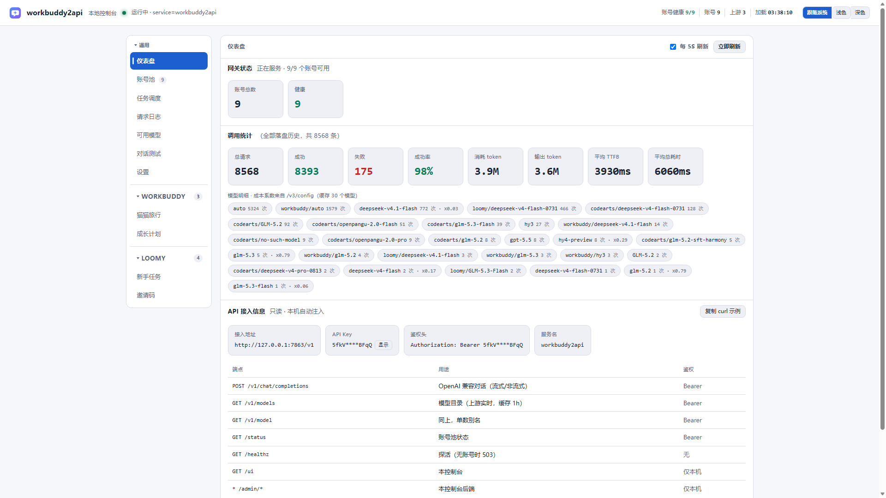
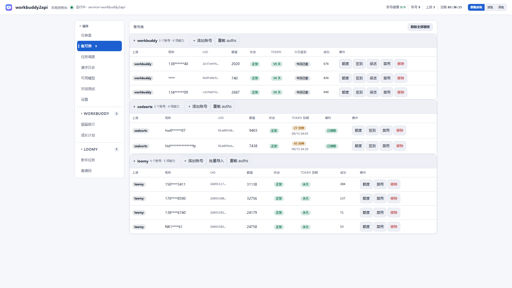
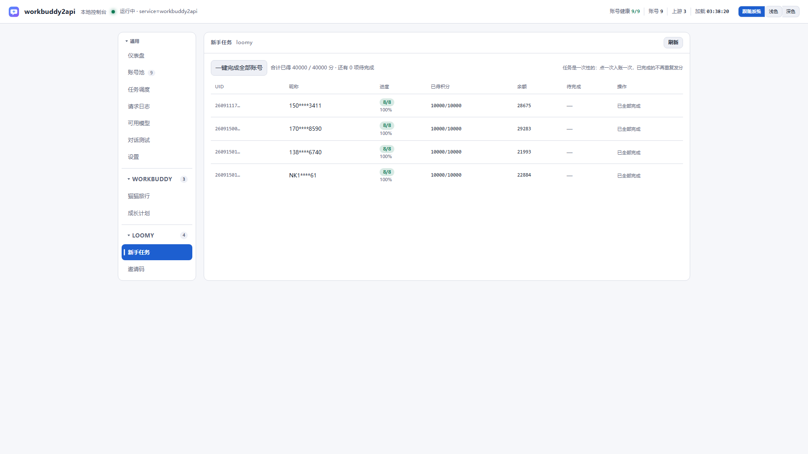
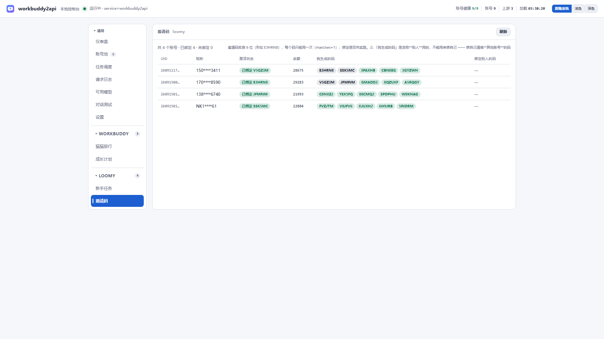
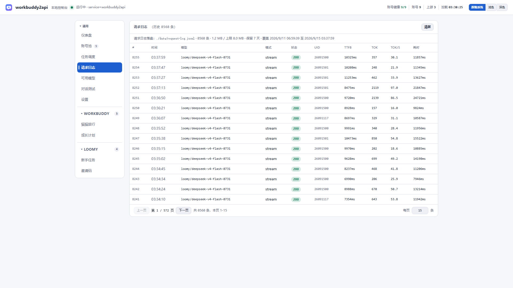

<p align="center">
  
</p>

<h1 align="center">multi2api</h1>

<p align="center">
  <b>把多个 AI 上游（WorkBuddy / CodeArts / Loomy）聚合成 OpenAI 兼容 API 的多账号网关</b><br>
  统一鉴权 · 账号池轮转 · 熔断与冷却 · 会话粘性 · 定时调度 · 管理控制台
</p>

## 这是什么

**multi2api 是一个多上游聚合反代网关**：把多个上游账号聚合成一个 OpenAI 兼容的
`base_url` + `api_key`。你的应用只认 OpenAI 协议，网关负责背后的上游选号、额度、
签到、续期、冷却与排障。

```
你的应用 ──► multi2api ──┬──► WorkBuddy（腾讯 CodeBuddy 桌面端）
                         ├──► CodeArts（华为云 CodeArts）
                         └──► Loomy（讯飞 Loomy 桌面端）
```

> 注意：**它不再只是 WorkBuddy 专用**。架构上"加一个上游 = 加一个目录 + 实现一组
> 接口 + 配置加一段，核心零改动"——这是本项目最硬的判据，由架构约束测试守着。

## ✨ 核心能力

| 能力 | 说明 |
|---|---|
| 🔌 **OpenAI 兼容** | `POST /v1/chat/completions`（流式/非流式）、`GET /v1/models`、`GET /healthz`；任何 OpenAI SDK 直接可用 |
| 🧠 **统一账号池** | 多上游账号混在一个池：健康/冷却/熔断/禁用/在途状态机，按权重自动选号，坏号自动摘除 |
| 🔄 **自动调度** | 定时签到、保活、旅行领奖、额度刷新——全部由各上游**自报**的清单生成，加新上游核心零改动 |
| 🛡️ **错误治理** | 硬冷却（额度耗尽）/软限流/会话失效/内容拦截分类处置：该换号换号、该禁用禁用 |
| 🖥️ **管理控制台** | `/ui` 单页：仪表盘 / 账号池 / 模型目录 / 对话测试 / 请求日志 / 设置 / 上游专属标签页 |
| 🔑 **安全默认** | `api_key` 鉴权、密钥只在本机注入、昵称自动打码、凭证按上游分子目录存放 |

## 📸 界面预览

| 仪表盘 | 账号池 |
|---|---|
|  |  |

| Loomy 新手任务 | Loomy 邀请码 | 请求日志 |
|---|---|---|
|  |  |  |

## 🐾 已接入上游

| 上游 | 账号形态 | 控制台能力 |
|---|---|---|
| **WorkBuddy** | OAuth 设备码登录 | 签到 / 保活 / 成长计划 / 猫猫旅行 / 任务一键完成 |
| **CodeArts** | OAuth + DPoP（约 2 小时 STS，自动续期） | 签到（福利领取）/ 额度探测 |
| **Loomy** | `session`（无 TTL） | **手机号验证码登录 / 新手任务一键完成 / 邀请码绑定 / 批量粘贴导入 / 额度实时查询** |

## 🚀 快速开始

### A. 下载预编译二进制

到 [Releases](../../releases) 下载对应平台包（用 `SHA256SUMS.txt` 校验）：

- Windows：`wb2api-server-windows-amd64.zip`（exe + `config.example.json` + `start.bat`）
- Linux：`wb2api-server-linux-amd64.tar.gz`

```bash
# Windows
unzip wb2api-server-windows-amd64.zip
cp config.example.json config.json     # 编辑：开上游、填 api_key
./wb2api-server -config config.json
```

### B. 从源码构建

```bash
go build -o wb2api-server ./cmd/server    # Go ≥ 1.22（CI 用 1.22.5）
./wb2api-server -config config.json
```

### 添加账号

- **WorkBuddy / CodeArts**：控制台「账号池」分组行点「＋ 添加账号」，走各自的登录流程。
- **Loomy**：点「＋ 添加账号」可**输手机号 + 验证码登录**；或点「批量导入」直接粘贴
  JSON（`[{"phone":"...","userid":"...","session":"..."}]`，支持多条）；或把凭证放进
  `auths/loomy/loomy-<uid>.json` 后点「重载 auths」。

## ⚙️ 配置说明

全部配置在 `config.json`（参考 `config.example.json`）。核心项：

| 项 | 默认 | 说明 |
|---|---|---|
| `listen` | `127.0.0.1:7863` | 监听地址（默认只绑本机） |
| `api_key` | — | 调用方 Bearer 鉴权；为空则不鉴权（不建议） |
| `auth_dir` | `./auths` | 凭证根目录，各上游分子目录存放 |
| `pool.*` | — | 账号池：熔断阈值、在途上限、冷却时长等 |
| `schedule.*` | — | 签到/保活时点与开关 |
| `workbuddy.*` / `codearts.*` / `loomy.*` | — | 各上游开关、目录与专用参数 |

**Loomy 特有配置段**：

| 项 | 默认 | 说明 |
|---|---|---|
| `loomy.enabled` | `false` | 显式启用（缺省不启用，向后兼容） |
| `loomy.client_data_dir` | `""`（自动探测） | 本机 Loomy 客户端 Local Storage 目录（决定本机拾取/额度回退） |
| `loomy.login_mode` | `auto` | `auto` 先本机拾取 / `sms` 只走手机号验证码 / `local` 只本机拾取 |
| `loomy.sms_*` | 内嵌默认 | 讯飞账号网关（base_url / app_id / access key），一般不用改 |

## 🖥️ 管理控制台

访问 `http://127.0.0.1:7863/ui`（本机访问自动注入 Key，顶栏可复制 curl 示例）。

- **仪表盘**：网关状态（账号总数 / 健康）+ 调用统计（总请求 / 成功率 / 消耗 token /
  平均 TTFB 等）+ API 接入信息。
- **账号池**：每个上游一张表（列集由上游**自报**，首列统一为「上游」；昵称自动打码），
  行内动作（签到 / 额度 / 保活 / 禁用 / 移除）按上游自报渲染。
- **Loomy 专属标签页**：新手任务（一键完成单账号 / 全部账号）、邀请码（绑定别人的码、
  查看自己生成的码，含 active/exhausted 状态）。
- **模型 / 对话测试 / 请求日志 / 设置**：日常排障所需都在页面上。

## 🔌 API

```bash
curl http://127.0.0.1:7863/v1/chat/completions \
  -H "Authorization: Bearer $API_KEY" -H "Content-Type: application/json" \
  -d '{"model":"loomy/deepseek-v4-flash-0731","messages":[{"role":"user","content":"hi"}],"stream":true}'
```

- 模型名带上游前缀：`loomy/xxx`、`workbuddy/xxx`、`codearts/xxx`；裸模型名走默认上游。
- 健康检查：`GET /healthz`（无鉴权，负载均衡友好）。
- 管理 API：`/admin/*`（默认只建议本机使用）。

## 🛡️ 安全与合规

- 网关默认只绑本机；对外暴露请自行加反向代理与更严格的鉴权。
- 凭证按上游分目录存于 `auths/`（已 gitignore）；控制台昵称自动打码。
- Loomy 短信登录的签名 key 随官方安装包分发（官方注释自述"混淆而非加密"），可通过
  `loomy.sms_*` 覆盖。
- 本项目面向**自有账号**的自动化管理与协议理解；请遵守各上游的服务条款与额度限制，
  控制并发、避免滥用。

## 🛠️ 开发

```bash
go test ./... -count=1     # 全量测试（含假上游契约测试，CI 中不跳过）
go vet ./... && gofmt -l . # 质量门禁
```

- **架构**：`internal/gateway` 是唯一接缝 —— `Provider` 4 方法 + 若干可选扩展点
  （登录流程 / 凭证加载 / 额度探测 / 每日动作 / 列集自报 / 凭证寿命 / 诊断端点……）。
  加新上游不改核心；`internal/gateway/arch_test.go` 自动约束包依赖方向。
- **CI**（`.github/workflows/ci.yml`）：`go mod tidy` 检查 / build / vet / gofmt / 全量测试。
- **发布**（`.github/workflows/release.yml`）：打 `v*` 标签自动构建 Windows/Linux 包、
  生成 `SHA256SUMS.txt` 并挂到 GitHub Release。

## 免责声明

本项目仅用于对自有账号/自有软件协议的理解与自动化，请遵守各相关平台的服务条款。
