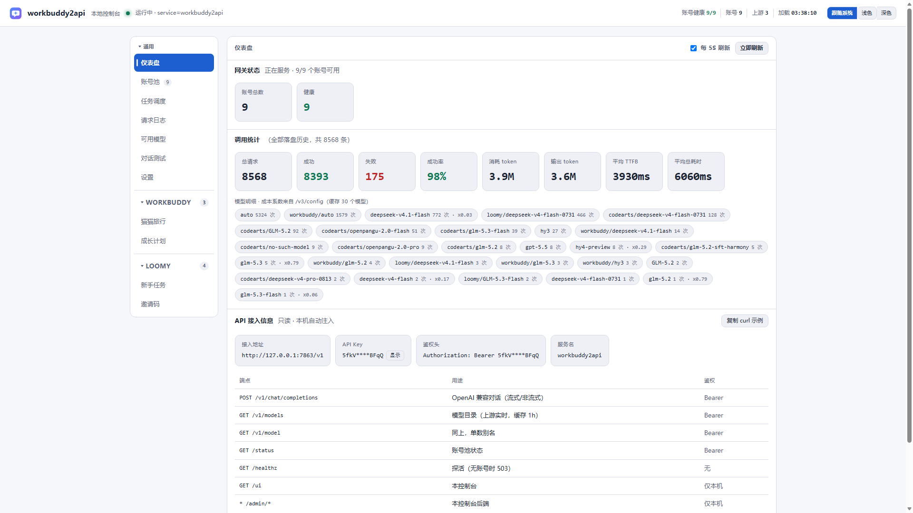
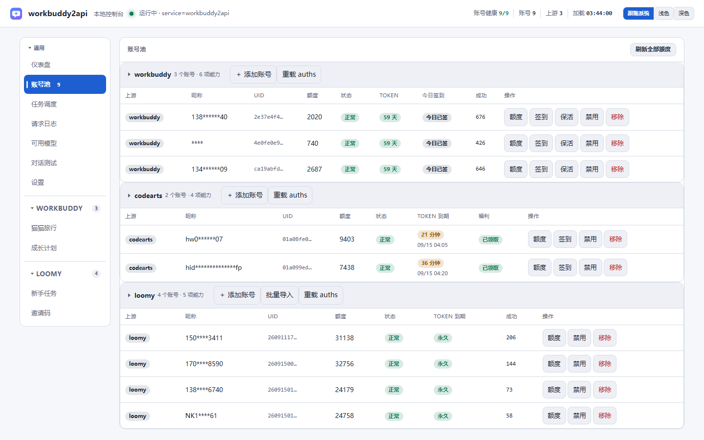
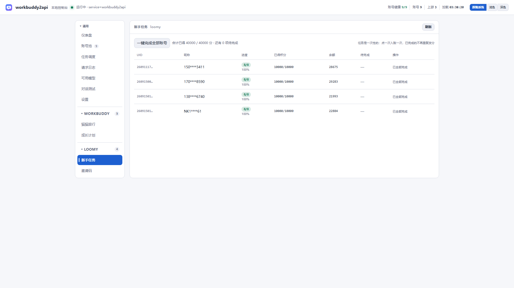
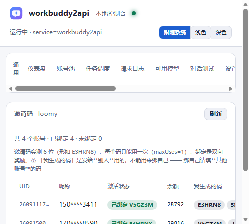
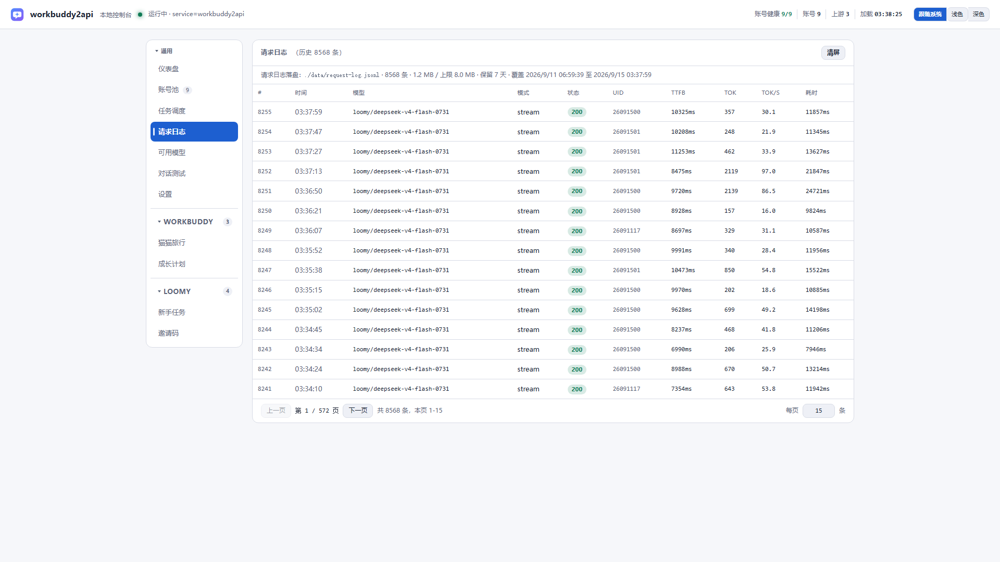

<p align="center">
  
</p>

<h1 align="center">multi2api</h1>

<p align="center">
  <b>把 10 个 AI 上游聚合成 OpenAI 兼容 API 的多账号网关</b><br>
  统一鉴权 · 账号池轮转 · 熔断与冷却 · 会话粘性 · 定时签到与续期 · 管理控制台
</p>

## 这是什么

**multi2api 是一个多上游聚合反代网关**：把多个上游账号聚合成一个 OpenAI 兼容的
`base_url` + `api_key`。你的应用只认 OpenAI 协议，网关负责背后的上游选号、额度、
签到、续期、冷却与排障。

```
你的应用 ──► multi2api ──┬──► WorkBuddy          腾讯 CodeBuddy 桌面端（默认上游）
                         ├──► WorkBuddy AI       海外版（www.workbuddy.ai）
                         ├──► CodeArts           华为云 CodeArts
                         ├──► Loomy              讯飞 Loomy 桌面端
                         ├──► Cline              Cline 桌面端
                         ├──► TRAE               字节 TRAE
                         ├──► Raccoon Work       商汤小浣熊
                         ├──► LobsterAI          有道龙虾
                         ├──► Qoder              阿里 Qoder
                         └──► Qoder（中国版）
```

> ⚠ **它不再是 WorkBuddy 专用**。架构上"加一个上游 = 加一个目录 + 实现一组接口 +
> 配置加一段，**核心零改动**"——这是本项目最硬的判据，由
> `internal/gateway/arch_test.go` 的**可执行断言**守着（不是约定）：
>
> - 核心包不得依赖任何具体上游
> - 上游之间不得互相依赖
> - 新增上游只需在 `cmd/server/main.go` 加一行 `registry.Register(...)`
>
> 从 4 个上游扩到 10 个的过程中，核心包**一行没改** —— 这条判据是实践过的，不是口号。

## ✨ 核心能力

| 能力 | 说明 |
|---|---|
| 🔌 **OpenAI 兼容** | `POST /v1/chat/completions`（流式/非流式）、`POST /v1/images/generations`（**生图**）、`GET /v1/models`、`GET /healthz`；任何 OpenAI SDK 直接可用 |
| 🧠 **统一账号池** | 多上游账号混在一个池：健康/冷却/熔断/禁用/在途状态机，按权重自动选号，坏号自动摘除 |
| 🎨 **生图** | 生图端点 + **对话工具自动注入**：拿任一对话题一句"画一张…"就自动调生图模型。返回**可预览的裸 URL**（见下方说明） |
| 🛠️ **对话工具注入** | 上游自报工具（Loomy 的生图 / 联网搜索）。**agent 框架零配置可用** —— 客户端自带的工具原样透传，网关注入的自己执行 |
| 🔄 **自动调度** | 定时签到、保活、旅行领奖、额度刷新、凭证续期——全部由各上游**自报**的清单生成，加新上游核心零改动 |
| ❤️‍🩹 **自愈机制** | **主动健康检查**（每 10 分钟探测冷却/熔断中的账号并提前恢复）、熔断错误按时间窗衰减（零散错误不攒坏账号）、凭证续期连续失败自动禁用 |
| 🛡️ **错误治理** | 硬冷却（额度耗尽）/软限流/会话失效/内容拦截分类处置：该换号换号、该禁用禁用。上游的**业务失败是 HTTP 200 + body 里的业务码**的，也按业务码处置 |
| 🖥️ **管理控制台** | `/ui` 单页：仪表盘 / 账号池 / 模型目录 / 对话测试 / 请求日志 / 设置 / 上游专属标签页 |
| 🔑 **安全默认** | `api_key` 鉴权、密钥只在本机注入、昵称自动打码、凭证按上游分子目录存放 |

## 📸 界面预览











## 🐾 已接入上游

| 上游 | 账号形态 | 控制台能力 |
|---|---|---|
| **WorkBuddy**（默认） | OAuth 设备码登录 | 签到 / 保活 / 成长计划 / 猫猫旅行 / 任务一键完成 |
| **WorkBuddy AI**（海外版） | OAuth 设备码登录（www.workbuddy.ai） | 对话 / 模型 / 额度查询（**海外版无签到/成长/旅行**，显式禁用）。按凭证的 `channel` 字段自动选域，国内与海外账号可同池共存 |
| **CodeArts** | OAuth + DPoP（约 2 小时 STS，自动续期） | 签到（福利领取）/ 额度探测 |
| **Loomy** | `session`（无 TTL） | 手机号验证码登录 / 新手任务一键完成 / 邀请码绑定 / 批量粘贴导入 / 额度实时查询 / **生图 + 联网搜索** |
| **Cline** | WorkOS 设备码轮询 | 余额查询 / 后台续期（**不起本地端口**，服务器部署天然可用） |
| **TRAE** | JWT + 消费型 refreshToken | 页内添加账号（浏览器授权） / 每日自动签到 / token 自动续期 / 权益包额度 |
| **Raccoon Work** | **浏览器授权（微信扫码 / 手机号）** | 积分余额 / 登录奖励 / onboarding 状态 |
| **LobsterAI** | 浏览器 OAuth 回跳 | 三步式签到领取积分 / 定时自动签到 |
| **Qoder / Qoder 中国版** | PKCE 设备码 | 积分余额 / 每日签到 / WASM 加密推理桥 |

## 🚀 快速开始

### A. 下载预编译二进制

到 [Releases](../../releases) 下载对应平台包（用 `SHA256SUMS.txt` 校验）：

- Windows：`wb2api-server-windows-amd64.zip`（exe + `config.example.json` + `start.bat`）
- Linux：`wb2api-server-linux-amd64.tar.gz` / `wb2api-server-linux-arm64.tar.gz`
- macOS：`wb2api-server-darwin-amd64.tar.gz` / `wb2api-server-darwin-arm64.tar.gz`

**全部五个平台由 CI 构建**（本机不手工上传产物），命名统一为
`wb2api-server-<goos>-<goarch>.<zip|tar.gz>`。

```bash
# Windows
unzip wb2api-server-windows-amd64.zip
cp config.example.json config.json     # 编辑：开上游、填 api_key
./wb2api-server -config config.json
```

### B. 从源码构建

```bash
go build -o wb2api-server ./cmd/server    # Go ≥ 1.22（CI 用 1.22.5）
./wb2api-server -config config.json
```

### 添加账号

控制台「账号池」分组行点「＋ 添加账号」，各上游走自己的流程：

- **WorkBuddy / CodeArts / TRAE / LobsterAI / Qoder / Raccoon**：点「添加账号」后
  **由网关用无痕窗口自动打开授权页**（见下方 `login.*`）。
  授权页里有各自的登录方式（扫码 / 设备码 / 手机号，取决于上游）。
  - **Raccoon**：打开的是**官方登录页**，页内有**微信扫码**与**手机号短信**两个 Tab。
    过完滑块点授权后会回调到本机端口，网关当场换取凭证。
  - 窗口被关掉时可点「重新无痕打开」，或点「复制链接」粘贴到无痕/隐私窗口。
- **Cline**：WorkOS 设备码轮询，**不起本地端口** —— 服务器部署也能用。
- **Loomy**：点「＋ 添加账号」可**输手机号 + 验证码登录**；或点「批量导入」直接粘贴
  JSON（`[{"phone":"...","userid":"...","session":"..."}]`，支持多条）；或把凭证放进
  `auths/loomy/loomy-<uid>.json` 后点「重载 auths」。

> ⚠ **关于无痕窗口**：默认给浏览器一份**独立 profile**（临时目录），
> 这次授权从零 cookie 开始 —— 避免浏览器里已登录的账号把会话串到别的账号上。
> 代价是需重新输入账号密码。

### 生图怎么用

两种方式，任选：

```bash
# ① 对话里说一句（网关自动调生图模型）
curl http://127.0.0.1:7863/v1/chat/completions \
  -H "Authorization: Bearer $API_KEY" -H "Content-Type: application/json" \
  -d '{"model":"loomy/deepseek-v4-flash-0731","messages":[{"role":"user","content":"画一张：赛博朋克城市夜景"}]}'

# ② 直接调生图端点（OpenAI 兼容）
curl http://127.0.0.1:7863/v1/images/generations \
  -H "Authorization: Bearer $API_KEY" -H "Content-Type: application/json" \
  -d '{"model":"loomy/doubao-seedream-5-lite","prompt":"赛博朋克城市夜景","n":1,"size":"1024x1024"}'
```

生图模型会出现在 `GET /v1/models` 里，带 `capabilities: ["image_generation"]` ——
调用方据此知道该用 `/v1/images/generations` 而不是 `/chat/completions`。

> ⚠ **返回的图片 URL 是"裸 URL"**（已剥掉 COS 签名）。这不是偷懒：上游给的是签名
> URL，而它对 **HEAD 请求必然 403**（COS 把 HTTP method 也算进签名，URL 是按 GET 签的），
> 而预览器 / 取图器 / 文件发送队列**通常先发 HEAD** 探测 —— 一探测就失败，
> 表现为"图片无法预览 / 拿不到文件实体"。
>
> 原始签名 URL 保留在同级的 `url_signed` 字段里作兜底（bucket 若改成私有读，
> 会自动退回它）。

### `agent` 框架里用（零配置）

网关把上游工具**注入**给模型，并在网关侧执行 —— 所以 **agent 框架（DSH /
Claude Code / Cursor 等）不需要在配置里声明任何工具**：

| 模型调谁 | 谁执行 | agent 框架看到什么 |
|---|---|---|
| 客户端自己的（`bash` / `read` / …） | **客户端** | 正常的 `tool_calls` |
| 网关注入的（`generate_image` / `web_search`） | **网关** | 只见模型"直接回了张带图的 markdown" |

即两边**按工具名分工**，互不打架。想关掉注入：`server.disables_chat_tools: true`
（⚠ 只影响**注入**；客户端自己带 `tools` 时本就按名分工，与此开关无关）。

## ⚙️ 配置说明

全部配置在 `config.json`（参考 `config.example.json`）。核心项：

| 项 | 默认 | 说明 |
|---|---|---|
| `listen` | `127.0.0.1:7863` | 监听地址（默认只绑本机） |
| `api_key` | — | 调用方 Bearer 鉴权；为空则不鉴权（不建议） |
| `auth_dir` | `./auths` | 凭证根目录，各上游分子目录存放 |
| `server.*` | — | `max_body_mb`（请求体上限）、`disables_chat_tools`（关工具注入） |
| `pool.*` | — | 账号池：熔断阈值、在途上限、冷却时长、`health_check_interval_seconds` |
| `schedule.*` | — | 签到 / 保活的间隔与开关（**统一 30 分钟被动扫描**） |
| `session_sticky.*` | `enabled=true` / `ttl=30m` / `gc_interval=5m` | 会话粘性：同一会话固定用同一账号 |
| `upstream.*` | 内嵌默认 | 出站身份（UA / 客户端版本 / 设备 token / IP 透传） |
| `prompt.*` | 内嵌默认 | 系统提示词（`mode` = `custom` / `passthrough`，空值按 `custom`；`file` 可指向自定义文件） |
| `upstash.*` | — | 可选 Redis/Upstash 后端；不配则纯内存 |

各上游的配置段（都支持 `enabled` / `auth_dir`，其余见下）：

`workbuddy` · `workbuddy_intl` · `codearts` · `loomy` · `trae` · `cline` ·
`raccoon` · `lobsterai` · `qoder`

**「添加账号」的浏览器行为（`login.*`）**：

| 项 | 默认 | 说明 |
|---|---|---|
| `login.open_browser` | `true` | 点「＋ 添加账号」时由网关自动用**无痕窗口**打开授权页；`false` = 只回授权链接 |
| `login.isolated` | `true` | 给浏览器一份**独立 profile**（临时目录，48h 后自动清理）：这次授权从零 cookie 开始，代价是需重新输入账号密码；`false` = 复用当前 profile，仅开无痕窗口 |
| `login.browser` | `""`（自动探测） | 显式指定浏览器可执行文件路径；探测顺序 Edge → Chrome → Brave → Chromium（macOS 走 `open -n -a`） |

本机没有任何受支持的浏览器、或运行在无 GUI 环境时，启动日志会说明原因，
「添加账号」自动退回「复制链接 → 粘贴到无痕窗口」的老路径（功能不受影响）。

**Loomy 特有配置段**：

| 项 | 默认 | 说明 |
|---|---|---|
| `loomy.enabled` | `false` | 显式启用（缺省不启用，向后兼容） |
| `loomy.client_data_dir` | `""`（自动探测） | 本机 Loomy 客户端 Local Storage 目录（决定本机拾取/额度回退） |
| `loomy.login_mode` | `auto` | `auto` 先本机拾取 / `sms` 只走手机号验证码 / `local` 只本机拾取 |
| `loomy.sms_*` | 内嵌默认 | 讯飞账号网关（base_url / app_id / access key），一般不用改 |

**TRAE 特有配置段**：

| 项 | 默认 | 说明 |
|---|---|---|
| `trae.auth_dir` | `<auth_dir>/trae` | 凭证目录（`trae-*.json`，嵌套或扁平两种形态都认） |
| `trae.refresh_interval_seconds` | `1800` | 后台 token 自动续期扫描间隔（`<=0` 关闭） |
| `trae.checkin_enabled` | `true` | 每日自动签到（30 分钟扫一次，幂等） |
| `trae.agent_base_url` / `ug_base_url` / `oauth_base_url` | 内嵌默认 | 三个 host 覆盖（一般不用改） |

## 🖥️ 管理控制台

访问 `http://127.0.0.1:7863/ui`（本机访问自动注入 Key，顶栏可复制 curl 示例）。

- **仪表盘**：网关状态（账号总数 / 健康）+ 调用统计（总请求 / 成功率 / 消耗 token /
  平均 TTFB 等）+ API 接入信息。
- **账号池**：每个上游一张表（列集由上游**自报**，首列统一为「上游」；昵称自动打码），
  行内动作（签到 / 额度 / 保活 / 禁用 / 移除）按上游自报渲染。
- **Loomy 专属标签页**：新手任务（一键完成单账号 / 全部账号）、邀请码（绑定别人的码、
  查看自己生成的码，含 active/exhausted 状态）。
- **模型 / 对话测试 / 请求日志 / 设置**：日常排障所需都在页面上。

## 🔌 API

```bash
curl http://127.0.0.1:7863/v1/chat/completions \
  -H "Authorization: Bearer $API_KEY" -H "Content-Type: application/json" \
  -d '{"model":"loomy/deepseek-v4-flash-0731","messages":[{"role":"user","content":"hi"}],"stream":true}'
```

- 模型名带上游前缀：`loomy/xxx`、`workbuddy/xxx`、`codearts/xxx`…；裸模型名走默认上游。
- `GET /v1/models`：各上游目录合并（含生图模型，带 `capabilities` 标注）。
- `POST /v1/images/generations`：OpenAI 兼容生图。
- 健康检查：`GET /healthz`（**无鉴权**，负载均衡友好）；`GET /status`（需鉴权，带详情）。
- 管理 API：`/admin/*`（默认只建议本机使用）。

## 🛡️ 安全与合规

- 网关默认只绑本机；对外暴露请自行加反向代理与更严格的鉴权。
- 凭证按上游分目录存于 `auths/`（已 gitignore）；控制台昵称自动打码。
- Loomy 短信登录的签名 key 随官方安装包分发（官方注释自述"混淆而非加密"），可通过
  `loomy.sms_*` 覆盖。
- 本项目面向**自有账号**的自动化管理与协议理解；请遵守各上游的服务条款与额度限制，
  控制并发、避免滥用。

## 🛠️ 开发

```bash
go build ./... && go vet ./...        # 构建 + 静态检查
go test ./... -count=1                # 全量测试（含假上游契约测试，CI 中不跳过）
gofmt -l .                            # 格式检查
```

> ⚠ **Windows 上 `gofmt -l .` 会误报**（CRLF 被当成格式问题）。本地判真实情况要先
> LF 归一化再查；CI（Linux）不受影响。
>
> ⚠ `go test -race` 在 CI 里是 **advisory**（`continue-on-error: true`）。
> 本机若无 gcc 则跑不了 —— **不要假装跑过**。

- **架构**：`internal/gateway` 是唯一接缝 —— `Provider` 4 方法 + 若干可选扩展点
  （登录流程 / 凭证加载 / 额度探测 / 每日动作 / 列集自报 / 凭证寿命 / 后台任务 /
  生图 / 对话工具 / 诊断端点……）。加新上游不改核心；
  `internal/gateway/arch_test.go` 自动约束包依赖方向（判据是**包级依赖图**，
  不是源码文本匹配）。
- **CI**（`.github/workflows/ci.yml`）：`go mod tidy` 检查 / build / vet / gofmt /
  全量测试（五项门禁，缺一不可合）。
- **发布**（`.github/workflows/release.yml`）：打 `v*` 标签自动构建
  **五个平台**（windows-amd64 / linux-amd64 / linux-arm64 / darwin-amd64 /
  darwin-arm64）、生成 `SHA256SUMS.txt` 并挂到 GitHub Release。
  发布 Release 的**说明由人写**（含回滚方案），workflow 只负责产物。

## 免责声明

本项目仅用于对自有账号/自有软件协议的理解与自动化，请遵守各相关平台的服务条款。
